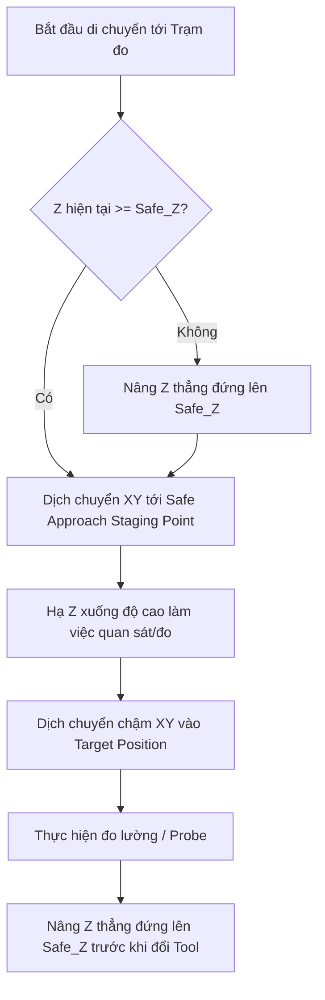

# AGENT MANAGEMENT & SYSTEM BLUEPRINT: TOOL-KLIPPER-CALIBRATION
**Dự án:** Hệ Thống Cân Chỉnh Tự Động Độ Lệch XY & Z Cho Hệ Klipper Toolchanger  
**Tài liệu:** `agent.md` — Quản trị dự án, Kiến trúc kỹ thuật, Phân rã công việc & Tiêu chuẩn phát triển  
**Phiên bản:** 1.0.0  
**Trạng thái:** Kế hoạch kiến trúc (Chưa triển khai mã nguồn gốc)

---

## 1. TỔNG QUAN VÀ MỤC TIÊU DỰ ÁN (PROJECT VISION)

### 1.1. Bối cảnh & Thách thức
Trong hệ thống máy in 3D đa công cụ (Klipper Toolchanger), độ chính xác chuyển đổi giữa các toolhead (T0, T1, T2,...) quyết định chất lượng in. Sự sai lệch cơ khí giữa các đầu phun diễn ra trên cả 3 trục:
- **Trục XY:** Độ lệch tâm giữa các vòi phun (nozzle orifice). Phương pháp căn chỉnh thủ công bằng mắt hoặc in vạch kẻ (vernier scale) tốn nhiều thời gian, lãng phí nhựa và độ chính xác thấp (sai số thường > 0.1mm).
- **Trục Z:** Độ chênh lệch chiều dài vật lý giữa các đầu phun. Nếu sai lệch, đầu in thấp sẽ cày xước lớp in hoặc gây kẹt, đầu in cao sẽ không kết dính lớp in.

### 1.2. Mục tiêu cốt lõi (Core Requirements)
1. **Đo độ lệch XY tự động bằng Machine Vision (Camera):** Nhận diện tâm lỗ vòi phun (nozzle orifice) qua camera hướng lên (upward-facing camera), tự động dịch chuyển đưa đầu in về tâm quang học và tính toán ma trận chuyển đổi từ pixel sang milimet thực tế.
2. **Đo độ lệch Z đa hạ tầng (Flexible Z-Backend):** Hỗ trợ linh hoạt cả 2 phương pháp:
   - **Switch / Endstop:** Cảm biến cơ / công tắc quang cố định để chạm đầu vòi phun.
   - **Cartographer Touch Probe:** Tận dụng công nghệ Eddy Current / Touch Home & Probe của Cartographer 3D (V4).
3. **Cơ chế vị trí an toàn động (Dynamic Safe Staging Positions):** Thay vì bắt buộc người dùng nhập toạ độ cố định cứng nhắc tiềm ẩn rủi ro gãy vòi va chạm camera/dock, hệ thống cho phép chỉ định/lưu toạ độ an toàn (Safe Approach / Safe Travel) bằng thao tác jog máy thực tế hoặc cấu hình linh hoạt.
4. **Hệ thống Macro chẩn đoán & cảnh báo lỗi toàn diện (Comprehensive Diagnostic Macros):** Cung cấp trạng thái chi tiết, mã lỗi chuẩn hoá (Error Codes), nguyên nhân hỏng hóc (quá sáng, mờ nét, camera offline, timeout, kẹt switch) và gợi ý khắc phục ngay trên Klipper console / Mainsail / Fluidd.
5. **Tự động hoá hoàn toàn 1 chạm (Full 1-Click Automation):** Sau khi nạp toạ độ an toàn và cấu hình, chỉ với một lệnh Macro (ví dụ: `CALIBRATE_TOOL_OFFSETS`), hệ thống tự động chạy toàn bộ quy trình từ T0 đến Tn, tính toán và lưu trực tiếp `gcode_x_offset`, `gcode_y_offset`, `gcode_z_offset` vào file cấu hình Klipper mà không cần con người can thiệp.

---

## 2. PHÂN TÍCH 3 DỰ ÁN THAM KHẢO (REFERENCES BENCHMARK)

Thư mục `References/` chứa 3 dự án mã nguồn mở đã được kiểm chứng tính ổn định:

| Tiêu chí | **Axiscope-cartographer** | **kTAMV** | **TAMV (Danal/Jubilee)** |
| :--- | :--- | :--- | :--- |
| **Môi trường chạy** | Klipper plugin + Web UI giao diện web riêng | Klipper plugin + Background Web Server (Waitress) | Python Standalone GUI (Duet/RRF & Klipper beta) |
| **Cân chỉnh XY** | Thủ công (người dùng nhìn stream webcam rồi ấn nút jog) | **Tự động** bằng OpenCV (SimpleBlobDetector) | **Tự động** bằng OpenCV (Cascade Detectors + Filter) |
| **Cân chỉnh Z** | **Rất mạnh:** Hỗ trợ Switch Endstop + Cartographer Touch | Không hỗ trợ (chỉ làm XY) | Hỗ trợ Electrical Touch Plate (tiếp xúc điện) |
| **Tách biệt luồng xử lý** | Chạy trong klippy reactor & HTTP server | Độc lập: Server Flask riêng, Klippy gọi HTTP client | Độc lập hoàn toàn trên máy chủ riêng biệt |
| **Lưu trữ Offset** | Tự động cập nhật `printer.cfg` (regex edit) | In ra console, yêu cầu người dùng tự lưu qua macro | Gửi lệnh `G10 Px` đến firmware Duet |
| **An toàn chuyển động** | Chỉ có `lift_z`, không có safe waypoints trước khi đo | Toạ độ camera cố định, di chuyển thẳng, dễ va quệt | Phụ thuộc script điều khiển ngoài |

### 2.1. Điểm mạnh cần kế thừa
- **Từ kTAMV:** Kiến trúc Micro-service phân tách (Decoupled Client-Server). Xử lý ảnh OpenCV và tính toán ma trận affine/đa thức bậc 2 được đẩy sang Web Server riêng (Waitress / FastAPI). Điều này ngăn chặn triệt để lỗi chí mạng **`Timer too close`** (Klipper bị treo reactor do tính toán nặng).
- **Từ TAMV:** Bộ thuật toán xử lý ảnh 3 cấp (Standard, Relaxed, Super-Relaxed Blob Detector) kết hợp tiền xử lý nhiều tầng (Gaussian Blur, Adaptive Threshold, Morphological Filters) giúp nhận diện chính xác lỗ nozzle ngay cả khi nozzle bằng đồng, thép cứng hoặc dính ít cặn nhựa.
- **Từ Axiscope:** Kiến trúc Z-Backend linh hoạt (Switch Probe và Cartographer Touch workflow), cơ chế hook macro theo chu kỳ (`before_pickup_gcode`, `after_pickup_gcode`, `start_gcode`, `finish_gcode`) và module ghi đè an toàn toạ độ offset vào cấu hình Klipper.

### 2.2. Khoảng trống & Thiếu sót cần cải tiến (Gap Analysis & Enhancements)
1. **Thiếu sự tích hợp XY + Z trong cùng một pipeline:** kTAMV chỉ đo XY, Axiscope chỉ tự động đo Z còn XY phải căn thủ công. Dự án mới sẽ kết hợp **Full-Auto Dual XY+Z Calibration** trong 1 luồng xử lý đồng nhất.
2. **Nguy cơ va chạm phần cứng do đường di chuyển cứng nhắc:** Các dự án cũ di chuyển thẳng (`G0 X... Y...`) tới tâm camera hoặc điểm probe. Nếu máy có chướng ngại vật (dock tool, camera housing nhô cao, kẹp bàn in), nozzle sẽ va chạm. **Giải pháp cải tiến:** Thiết lập **Safe Navigation State Machine** (Safe Travel Height -> Approach Waypoint -> Measurement Point -> Retract Waypoint).
3. **Cơ chế lưu toạ độ an toàn tương tác:** Người dùng có thể di chuyển đầu phun đến vị trí quan sát an toàn và nhấn `CALIBRATION_SAVE_SAFE_POS` thay vì phải đo đạc nhập tay vào config.
4. **Chẩn đoán lỗi nghèo nàn:** Các dự án cũ chỉ báo lỗi chung chung (`Did not find nozzle` hoặc `Z probe error`). **Giải pháp cải tiến:** Hệ thống phân loại mã lỗi có cấu trúc (E101 - E404), kiểm tra trước điều kiện chạy (Pre-flight checks: homing, nhiệt độ, kết nối camera, Cartographer readiness) và đưa ra chỉ dẫn phục hồi chi tiết.
5. **Bảo vệ file cấu hình khi tự động lưu:** Tránh ghi đè làm hỏng `printer.cfg`. Tự động tạo bản backup có gắn timestamp trước khi can thiệp và hỗ trợ lưu vào file con độc lập (ví dụ `tool_offsets.cfg` được `[include]` vào `printer.cfg`).

---

## 3. KIẾN TRÚC HỆ THỐNG (SYSTEM ARCHITECTURE)

Hệ thống được thiết kế theo mô hình **Client - Service Decoupled Architecture**:

```
+-----------------------------------------------------------------------------+
|                          KLIPPER HOST (Raspberry Pi / CB1)                 |
|                                                                             |
|   +---------------------------------------------------------------------+   |
|   |                  Klipper Service (Python 3 - Klippy)                |   |
|   |                                                                     |   |
|   |   [klippy/extras/tool_calibrator.py]                                |   |
|   |   - State Machine & Task Scheduler                                  |   |
|   |   - Kinematics & Safe Waypoint Navigation Controller                |   |
|   |   - Multi-Backend Z Calibration Engine (Switch / Cartographer)      |   |
|   |   - Config Persister & Backup Manager                               |   |
|   |   - G-Code Command Interfaces & Event Listeners                     |   |
|   +---------------------------------------------------------------------+   |
|               |                                       ^                     |
|               | HTTP REST / JSON IPC                 | Toolhead Moves /    |
|               v                                       | Endstop Probing     |
|   +---------------------------------------+   +-------------------------+   |
|   | Tool Calibrator Vision Service        |   | Toolchanger Hardware    |   |
|   | (Async Python Service - Port: 8090)   |   | - T0...Tn Toolheads     |   |
|   |                                       |   | - Physical Z Switch     |   |
|   | - Crowsnest / MJPEG Frame Grabber     |   | - Cartographer Probe    |   |
|   | - Multi-Stage OpenCV Pipeline         |   | - Nozzle Cam & LED      |   |
|   | - MPP (mm/pixel) Calibration Engine   |   +-------------------------+   |
|   | - Transformation Matrix Solver        |                                 |
|   | - Visual Debug Web UI Streamer        |                                 |
|   +---------------------------------------+                                 |
|                       ^                                                     |
|                       | Pulls Video Stream                                  |
|   +---------------------------------------+                                 |
|   | Crowsnest / Camera Stream (HTTP)      |                                 |
|   +---------------------------------------+                                 |
+-----------------------------------------------------------------------------+
```

### 3.1. Các thành phần chính
1. **`klippy/extras/tool_calibrator.py` (Klipper Module):**
   - Đóng vai trò bộ não điều phối (Orchestrator).
   - Quản lý các lệnh G-Code: `CALIBRATE_TOOL_OFFSETS`, `CALIBRATE_TOOL_XY`, `CALIBRATE_TOOL_Z`, `CALIBRATION_SET_SAFE_POS`, `CALIBRATION_SAVE_OFFSETS`.
   - Điều khiển nạp/nhả tool qua lệnh Toolchanger tiêu chuẩn.
   - Giao tiếp bất đồng bộ với Vision Service qua socket/HTTP timeout an toàn.
2. **`server/tool_calibrator_server.py` (Vision Background Service):**
   - Chạy độc lập dưới dạng `systemd service`.
   - Kéo ảnh trực tiếp từ stream của Crowsnest/Mainsail.
   - Sử dụng NumPy và OpenCV xử lý nhận diện vòng tròn lỗ nozzle, tính ma trận Affine 2D/Perspective và nội suy toạ độ thực.
   - Cung cấp web stream preview kèm overlay (crosshair, vòng tròn phát hiện, bounding box) phục vụ giám sát trên giao diện Web.
3. **`macros/tool_calibration_macros.cfg` (G-Code Macro Suite):**
   - Các macro cấp cao cho người dùng: `AUTO_CALIBRATE_ALL_TOOLS`, `SAFE_PARK_CAMERA`, `CHECK_CALIBRATION_STATUS`.
   - Cơ chế Hook tùy biến: `START_CALIBRATION_HOOK`, `BEFORE_TOOL_CHANGE_HOOK`, `AFTER_TOOL_CHANGE_HOOK`, `END_CALIBRATION_HOOK`.

---

## 4. CHIẾN LƯỢC TOẠ ĐỘ AN TOÀN & ĐỘNG HỌC (DYNAMIC SAFE NAVIGATION)

Để giải quyết triệt để yêu cầu: *"Người dùng có thể chỉ định vị trí an toàn trước khi đo thay vì nhập vị trí cố định"*:

### 4.1. Không gian toạ độ 3 tầng (Three-Tier Safety Navigation)
Mỗi trạm đo (Camera Station và Z-Probe Station) được định nghĩa bởi 3 toạ độ:
1. **`Safe Clearance Z (`safe_z`)`:** Độ cao Z an toàn tuyệt đối. Mọi chuyển động XY đường dài giữa các khu vực (Tool dock -> Station) BẮT BUỘC phải nâng trục Z lên đến độ cao này trước khi chạy XY.
2. **`Approach Staging Position (`safe_approach_xy`)`:** Điểm dừng chờ bên ngoài bán kính trạm đo. Đầu in sẽ di chuyển tới đây trước khi hạ xuống độ cao làm việc của camera hoặc switch, ngăn ngừa việc va quệt theo phương xiên.
3. **`Target Focal / Probe Position (`target_xy`, `target_z`)`:** Điểm đo thực tế.

### 4.2. Quy trình dịch chuyển an toàn (Safe Move Execution Logic)


### 4.3. Lệnh tương tác lưu toạ độ an toàn (Interactive Safe Teaching)
- Người dùng chỉ cần lái máy (jog) đến điểm an toàn mong muốn trên Mainsail/Fluidd rồi gọi lệnh:
  - `CALIBRATION_SET_SAFE_POS STATION=CAMERA TYPE=APPROACH` -> Lưu vị trí hiện tại làm điểm chờ camera.
  - `CALIBRATION_SET_SAFE_POS STATION=CAMERA TYPE=FOCAL` -> Lưu vị trí hiện tại làm tâm tiêu cự camera.
  - `CALIBRATION_SET_SAFE_POS STATION=Z_SWITCH TYPE=APPROACH` -> Lưu vị trí an toàn trước khi probe switch.
  - `CALIBRATION_SET_SAFE_POS STATION=Z_SWITCH TYPE=PIN` -> Lưu toạ độ đỉnh switch.
- Lệnh tự động ghi lại toạ độ vào bộ nhớ tạm hoặc cập nhật trực tiếp vào file cấu hình `tool_offsets.cfg`.

---

## 5. HỆ THỐNG MÃ LỖI & CHẨN ĐOÁN TOÀN DIỆN (ERROR DIAGNOSTICS & TELEMETRY)

Nhằm đáp ứng yêu cầu: *"Hệ thống macro có thể cung cấp đầy đủ thông tin để xác định lỗi"*:

### 5.1. Bảng phân loại mã lỗi chuẩn (Standardized Error Taxonomy)

| Mã lỗi | Nhóm lỗi | Nguyên nhân chi tiết | Hành động ứng phó tự động & Gợi ý người dùng |
| :--- | :--- | :--- | :--- |
| **`ERR_PRE_001`** | Pre-flight | Máy in chưa home các trục X/Y/Z | Tự động hủy lệnh, thông báo: *"Yêu cầu G28 trước khi hiệu chuẩn."* |
| **`ERR_PRE_002`** | Pre-flight | Nhiệt độ đầu in > 100°C làm giãn nở cơ khí / bốc khói mờ camera | Tự động chờ nguội hoặc cảnh báo nhiệt độ an toàn |
| **`ERR_PRE_003`** | Pre-flight | Không tìm thấy active tool hoặc toolchanger ở trạng thái lỗi | Dừng máy, yêu cầu kiểm tra trạng thái kẹp tool |
| **`ERR_CAM_101`** | Vision | Vision Server offline (Không kết nối được Port 8090) | Thông báo: *"Tool Calibrator Server chưa chạy. Kiểm tra systemctl status"* |
| **`ERR_CAM_102`** | Vision | Stream camera từ Crowsnest bị timeout hoặc URL không hợp lệ | Cảnh báo URL webcam, chụp màn hình thử nghiệm |
| **`ERR_CV_201`** | Algorithm | Không tìm thấy vòng tròn nozzle (Nozzle Not Found) | Thử tự động lắc nhẹ đầu in (`wiggle 0.2mm`). Nếu vẫn lỗi: *"Lau sạch đầu phun hoặc tăng/giảm đèn LED"* |
| **`ERR_CV_202`** | Algorithm | Độ tròn (Circularity) hoặc diện tích không đạt ngưỡng | Thông báo: *"Đầu phun bị dính nhựa biến dạng hoặc tiêu cự Z camera bị mờ"* |
| **`ERR_CV_203`** | Algorithm | Hiệu chuẩn mm/pixel thất bại (> 25% điểm đo bị lệch ma trận) | Cảnh báo: *"Bước dịch chuyển camera không khớp thực tế. Kiểm tra trục camera"* |
| **`ERR_CV_204`** | Algorithm | Toạ độ tính toán vượt quá kích thước khung hình (Frame Out-of-Bounds) | Hủy di chuyển để tránh nozzle đâm ra ngoài khay camera |
| **`ERR_Z_301`** | Z-Probe | Switch Z không kích hoạt trong phạm vi hành trình (`max_distance`) | Cảnh báo: *"Switch Z không phản hồi. Kiểm tra dây tín hiệu hoặc vị trí Z"* |
| **`ERR_Z_302`** | Z-Probe | Cartographer Touch Home/Probe không trả về kết quả tiếp xúc | Kiểm tra kết nối Cartographer V4 qua CAN/USB, kiểm tra model touch |
| **`ERR_Z_303`** | Z-Probe | Độ lệch Z giữa 2 lần đo liên tiếp vượt ngưỡng an toàn (`z_tolerance > 0.05mm`) | Tự động probe lại lần 2; nếu vẫn sai lệch thì cảnh báo rơ lỏng cơ khí |
| **`ERR_CFG_401`** | Storage | Không thể mở hoặc parse file cấu hình `printer.cfg` | Tạo file backup khẩn cấp, ngăn chặn ghi đè làm mất cấu hình gốc |

### 5.2. Định dạng thông báo Telemetry ra Klipper Console
Mọi sự cố hoặc tiến trình đều được đẩy ra Console với tiền tố chuẩn:
```text
[TOOL_CALIB] [INFO] [T1] Đang di chuyển tới Safe Approach (X:150.00, Y:300.00, Z:25.00)...
[TOOL_CALIB] [INFO] [T1] Phát hiện Nozzle tại UV (320.5, 240.1), Độ tin cậy: 98.4%, Thuật toán: Standard
[TOOL_CALIB] [ERROR] [T2] [ERR_CV_201] Không tìm thấy vòi phun sau 3 lần thử!
  -> Vị trí máy: X:150.2 Y:300.1 Z:12.0
  -> Gợi ý: Kiểm tra cặn nhựa bám quanh vòi phun hoặc kiểm tra đèn chiếu sáng camera.
  -> Trạng thái: Quy trình tạm dừng an toàn. Đầu in đã nâng lên Z:25.00.
```

---

## 6. QUY CHUẨN MÃ NGUỒN & CÁCH COMMENT (CODING & COMMENTING STANDARDS)

### 6.1. Quy tắc viết mã Python (Klippy Extension & Vision Server)
1. **Tuân thủ chuẩn PEP 8:** Thụt dòng 4 spaces, đặt tên biến/hàm kiểu `snake_case`, tên lớp kiểu `CamelCase`, hằng số kiểu `UPPER_SNAKE_CASE`.
2. **Type Hinting:** Mọi hàm xử lý logic và tính toán phải có chú thích kiểu dữ liệu (Type Hints) để dễ bảo trì:
   ```python
   def calculate_offset(self, origin_uv: tuple[float, float], current_uv: tuple[float, float], mpp: float) -> tuple[float, float]:
       """
       Tính toán độ lệch thực tế (mm) dựa trên toạ độ camera và mm/pixel.
       """
   ```
3. **Phòng thủ ngoại lệ (Defensive Programming):**
   - Mọi khối gọi I/O mạng (HTTP request giữa Klippy và Vision Server) phải có `timeout` rõ ràng (tối đa 5 giây) để không làm đóng băng Klipper reactor.
   - Không dùng `except Exception: pass` trần trụi; mọi ngoại lệ phải được log lại và trả về mã lỗi `[ERR_xxx]`.
4. **Không chạy tác vụ nặng trong Klippy:** Klippy là đơn luồng với reactor hướng sự kiện. Mọi tác vụ OpenCV, tính ma trận NumPy, đọc file ảnh phải nằm ở `tool_calibrator_server.py`. Klippy chỉ nhận kết quả JSON toạ độ.

### 6.2. Quy chuẩn Comment & Tài liệu hoá mã nguồn
1. **Ngôn ngữ chú thích:** Tiếng Anh hoặc Tiếng Việt rõ nghĩa, thống nhất thuật ngữ kỹ thuật (không pha trộn nửa vời).
2. **Docstring chuẩn Google / Sphinx:**
   ```python
   class MultiAxisZProbeManager:
       """
       Điều phối đo kiểm Z-Offset đa backend (Cơ khí & Cartographer Touch).
       
       Attributes:
           backend (str): 'switch' hoặc 'cartographer'.
           probe_coords (tuple): Toạ độ XY điểm đo Z.
           samples (int): Số lần lấy mẫu trên mỗi đầu in.
       """
   ```
3. **Inline Comment:** Chỉ giải thích **LÝ DO (WHY)** tại sao viết như vậy thay vì giải thích dòng code làm gì (WHAT). Ví dụ:
   - *Đúng:* `# Nâng Z trước khi dịch chuyển XY để tránh nozzle va vào thành bảo vệ camera`
   - *Sai:* `# Gọi hàm move Z`

### 6.3. Quy chuẩn viết Klipper G-Code Macros
1. **Kiểm tra trạng thái máy trước khi di chuyển:** Luôn kiểm tra `printer.toolhead.homed_axes`.
2. **Tham số hoá linh hoạt:** Macro phải nhận các biến `DEFAULT`, ví dụ: ``.
3. **Mỗi thao tác quan trọng có thông báo:** Sử dụng `action_respond_info` để giao tiếp mạch lạc với Web UI.

---

## 7. KẾ HOẠCH PHÂN CHIA CÔNG VIỆC TỪNG TASK (WORK BREAKDOWN STRUCTURE - WBS)

Dự án được phân rã thành 6 Phase tuần tự, kiểm soát chặt chẽ theo từng mốc:

```
[Phase 1: Chuẩn bị & Kiến trúc] -> [Phase 2: Xây dựng Vision Server]
                                           |
[Phase 4: Tích hợp An toàn & Macro] <- [Phase 3: Xây dựng Klippy Extension]
         |
[Phase 5: Kiểm thử Toàn diện]       -> [Phase 6: Đóng gói & Phát hành]
```

### Phase 1: Hoàn thiện Tài liệu, Cấu trúc Thư mục & Môi trường Git
- **Task 1.1:** Khởi tạo Git repository, cấu hình `.gitignore`, chuẩn bị template commit.
- **Task 1.2:** Thiết lập tài liệu thiết kế chi tiết API REST JSON giữa Klippy và Vision Service.
- **Task 1.3:** Tạo cấu trúc thư mục dự án theo quy chuẩn mô-đun.

### Phase 2: Vision Service (Xử lý ảnh & Tính toán toạ độ)
- **Task 2.1:** Viết module kéo frame camera từ Crowsnest / Mainsail URL (`video_stream.py`).
- **Task 2.2:** Xây dựng thuật toán nhận diện vòng tròn Nozzle 3 tầng kế thừa từ TAMV (`detector.py`).
- **Task 2.3:** Xây dựng engine tính toán tỷ lệ mm/pixel (MPP) và ma trận biến đổi affine (`calibration_math.py`).
- **Task 2.4:** Xây dựng HTTP Service giao tiếp JSON (FastAPI hoặc Waitress/Flask) kèm Web Preview Overlay (`server.py`).

### Phase 3: Klipper Core Extension (`klippy/extras/tool_calibrator.py`)
- **Task 3.1:** Xây dựng khung giao tiếp G-Code Command, quản trị vòng đời module Klipper.
- **Task 3.2:** Phát triển Module Safe Navigation (quản lý 3 toạ độ an toàn, chuyển động bảo vệ).
- **Task 3.3:** Xây dựng XY Calibration Controller (kết nối Vision Service, điều khiển dịch chuyển lặp nozzle về tâm).
- **Task 3.4:** Xây dựng Z-Calibration Backend 1: Switch Endstop Probe (giao tiếp `tools_calibrate`).
- **Task 3.5:** Xây dựng Z-Calibration Backend 2: Cartographer Touch Probe (gọi `CARTOGRAPHER_TOUCH_HOME` và `CARTOGRAPHER_TOUCH_PROBE`, đọc touch model).
- **Task 3.6:** Module lưu cấu hình an toàn: Backup `printer.cfg` hoặc cập nhật file cấu hình riêng biệt `tool_offsets.cfg`.

### Phase 4: Macro Suite & Tích hợp Hệ thống
- **Task 4.1:** Viết bộ Macro G-Code: `CALIBRATE_ALL_TOOLS`, `CALIBRATE_TOOL_XY`, `CALIBRATE_TOOL_Z`.
- **Task 4.2:** Tích hợp bộ Hook: `start_gcode`, `before_pickup_gcode`, `after_pickup_gcode`, `finish_gcode`.
- **Task 4.3:** Viết Macro cấu hình toạ độ an toàn tương tác (`TEACH_SAFE_POSITION`).

### Phase 5: Thử nghiệm, Đánh giá & Tối ưu hoá (Testing & Benchmarking)
- **Task 5.1:** Kiểm thử giả lập (Simulation / Mock Camera): Test giải thuật nhận diện qua ảnh chụp mẫu nhiều loại nozzle.
- **Task 5.2:** Kiểm thử Dry-Run trên Klipper thật không bật nhiệt độ: Xác thực hành trình an toàn, kiểm tra không va chạm.
- **Task 5.3:** Kiểm thử hiệu chuẩn thực tế với T0 và T1-Tn: Đánh giá độ lặp lại (Repeatability) và độ chính xác (Accuracy).

### Phase 6: Tài liệu hướng dẫn & Kịch bản cài đặt tự động
- **Task 6.1:** Viết script cài đặt `install.sh` và gỡ cài đặt `uninstall.sh` (tạo virtualenv, cài opencv-python, tạo systemd service).
- **Task 6.2:** Cấu hình Moonraker update manager trong `moonraker.conf` để người dùng update 1-click qua giao diện web.
- **Task 6.3:** Viết tài liệu `README.md` hướng dẫn sử dụng bằng hình ảnh minh hoạ.

---

## 8. CHIẾN LƯỢC QUẢN LÝ GIT, LƯU TRỮ & TIẾN ĐỘ

### 8.1. Địa chỉ lưu trữ Remote Repository
- **Remote Origin URL:** `https://github.com/IDcrazy123/Tool-Klipper-Calibration.git`
- **Chính sách nhánh (Single Branch Policy):**
  - **Duy nhất một nhánh `main` (Trunk-Based Development).**
  - **Tuyệt đối KHÔNG phân nhánh (`no feature/develop branches`).**
  - Mọi công việc (phát triển tính năng, cải tiến, vá lỗi, cập nhật tài liệu) đều được commit và đẩy trực tiếp lên `main`.
  - Giữ cấu trúc lịch sử Git tuyến tính, rõ ràng, giúp hệ thống Klipper & Moonraker trên máy in cập nhật 1-click liền mạch mà không gặp xung đột branch.

### 8.2. Quy chuẩn Git Commit Message (Conventional Commits)
Mọi commit trên nhánh `main` phải tuân theo cấu trúc chuẩn:
```text
<type>(<scope>): <mô tả ngắn gọn bằng tiếng Anh hoặc tiếng Việt>

[Nội dung chi tiết giải thích lý do thay đổi nếu cần]

Ref: #<task-id>
```
Trong đó `<type>` gồm:
- `feat`: Tính năng mới (ví dụ: `feat(vision): add multi-stage nozzle detector`).
- `fix`: Sửa lỗi (ví dụ: `fix(klipper): prevent reactor timeout during camera sync`).
- `docs`: Cập nhật tài liệu (ví dụ: `docs(agent): update single main branch policy and remote repo`).
- `refactor`: Tái cấu trúc code nhưng không thay đổi hành vi bên ngoài.
- `test`: Thêm bài test hoặc kịch bản kiểm thử.

### 8.3. Quản lý cập nhật qua Moonraker (Auto-Update Manager)
Tích hợp sẵn cấu hình Moonraker trong tài liệu cài đặt, tự động theo dõi duy nhất nhánh `main`:
```ini
[update_manager tool_klipper_calibration]
type: git_repo
path: ~/Tool-Klipper-Calibration
origin: https://github.com/IDcrazy123/Tool-Klipper-Calibration.git
primary_branch: main
is_system_service: True
managed_services: tool_calibrator_server
```

---

## 9. QUY TRÌNH THỬ NGHIỆM & KIỂM CHỨNG (VERIFICATION PROTOCOL)

Nhằm đảm bảo an toàn tối đa cho phần cứng máy in (tránh va gãy đầu dò Cartographer, cong nozzle hoặc đâm hỏng camera):

### 9.1. Giai đoạn 1: Kiểm thử giải thuật trên dữ liệu tĩnh (Offline Synthetic Testing)
- Tạo thư mục ảnh mẫu `tests/sample_images/` chứa ảnh chụp nhiều loại nozzle: đồng bóng, thép đã qua sử dụng, nozzle bị dính vệt nhựa PETG/ABS, nozzle thiếu sáng, nozzle lệch tâm.
- Chạy unit test kiểm tra tỉ lệ nhận diện thành công của `detector.py` đạt $\ge 95\%$ trước khi đưa vào hệ thống chuyển động.

### 9.2. Giai đoạn 2: Kiểm thử chuyển động ảo (Dry-Run Kinematics Mode)
- Cung cấp cờ `DRY_RUN=1` trong lệnh gọi:
  ```gcode
  CALIBRATE_TOOL_OFFSETS DRY_RUN=1
  ```
- Klipper sẽ thực hiện toàn bộ lộ trình: Tool change -> Nâng Safe Z -> Di chuyển Safe Approach -> Di chuyển Target -> Báo cáo vị trí toạ độ nhưng **không hạ vòi chạm vật lý** và **không ghi đè file cấu hình**. Người dùng quan sát đường đi thực tế để đảm bảo không có nguy cơ va chạm.

### 9.3. Giai đoạn 3: Kiểm định độ lặp lại (Repeatability Test)
- Thực hiện đo 10 lần liên tiếp cho cùng 1 đầu in ở cả XY và Z.
- Tiêu chuẩn nghiệm thu:
  - Độ lệch chuẩn XY (Standard Deviation) $\sigma_{XY} \le 0.015\text{ mm}$.
  - Độ lệch chuẩn Z $\sigma_Z \le 0.008\text{ mm}$.

---

## 10. KHẢ NĂNG MỞ RỘNG TRONG TƯƠNG LAI (EXTENSIBILITY ROADMAP)

1. **Hỗ trợ thêm các Z-Backend khác:** Kiến trúc dạng module (Interface/Adapter pattern) cho phép dễ dàng cắm thêm các loại cảm biến Z mới như: Beacon3D, Boop/Tap sensor, Microswitch servo probe.
2. **AI / Deep Learning Nozzle Detection:** Tích hợp mô hình YOLO-Nano hoặc Edge-AI nhẹ để nhận diện tâm nozzle trong các điều kiện môi trường ánh sáng phức tạp mà thuật toán Blob Detector truyền thống gặp khó khăn.
3. **Hiệu chuẩn góc nghiêng vòi phun (Toolhead Tilt / Roll-Pitch Alignment):** Kết hợp camera quan sát góc nghiêng để xác định đầu phun có bị gắn lệch góc vuông so với mặt bàn hay không.
4. **Giao diện Web GUI Component (Mainsail/Fluidd Plugin):** Viết plugin hiển thị bảng điều khiển hiệu chuẩn trực quan ngay trên tab điều khiển chính của Mainsail/Fluidd.

---

## 11. BÁO CÁO CÁC ĐIỂM CẢI TIẾN ĐÃ ĐỀ XUẤT (IMPROVEMENT REPORT)

Theo đúng chỉ đạo của người dùng: *"cải tiến thêm nếu phát hiện thiếu xót (nếu cải tiến phải báo cáo đầy đủ)"*, dưới đây là bảng tổng hợp các điểm cải tiến cốt lõi đã được nghiên cứu và thiết kế bổ sung:

| STT | Vấn đề phát hiện ở các dự án cũ | Đề xuất cải tiến trong dự án mới | Lợi ích mang lại |
| :---: | :--- | :--- | :--- |
| **1** | Đường chạy thẳng tới tâm camera/switch dễ gây va chạm cơ khí vào dock/thành máy. | **Cơ chế toạ độ an toàn 3 tầng:** `Safe_Z` -> `Safe_Approach_XY` -> `Target_XY`. | Loại bỏ hoàn toàn nguy cơ va chạm vòi phun khi chuyển đổi vùng làm việc. |
| **2** | Người dùng phải đo đạc toạ độ rồi gõ tay thủ công vào config. | **Lệnh dạy toạ độ tương tác:** `CALIBRATION_SET_SAFE_POS`. | Người dùng chỉ cần jog đầu in bằng tay và ấn nút lưu, nhanh chóng và trực quan. |
| **3** | Axiscope chỉ hỗ trợ căn XY thủ công, kTAMV chỉ hỗ trợ XY tự động mà bỏ quên Z. | **Đồng bộ hoá toàn diện:** Tích hợp cả Vision XY Auto + Dual Z-Backend (Switch & Cartographer) vào 1 hệ thống duy nhất. | Người dùng chỉ cần 1 lệnh duy nhất là hiệu chuẩn xong toàn bộ hệ toolchanger. |
| **4** | Lỗi Klipper `Timer too close` khi xử lý ảnh nặng trong tiến trình Klippy. | **Kiến trúc phân tách Client-Server:** Kéo toàn bộ OpenCV/NumPy sang background service chạy độc lập với CPU core riêng. | Đảm bảo Klipper duy trì thời gian thực (realtime) ổn định, không bao giờ bị shutdown máy do tính toán nặng. |
| **5** | Thông báo lỗi cụt ngủn, không rõ nguyên nhân khiến người dùng bối rối khi thất bại. | **Hệ thống mã lỗi chuẩn hoá (`ERR_xxx`)** đi kèm gợi ý hành động xử lý trực tiếp trên Console. | Giúp người dùng biết chính xác cần làm gì (lau đầu phun, chỉnh đèn, kiểm tra dây probe,...). |
| **6** | Rủi ro hỏng file cấu hình chính `printer.cfg` khi lưu tự động. | **Cơ chế sao lưu Timestamp Backup** và tách riêng file `tool_offsets.cfg` độc lập. | Bảo vệ an toàn tuyệt đối cấu hình máy in, dễ dàng rollback khi cần. |

---

*Tài liệu này là căn cứ quản lý kỹ thuật xuyên suốt cho toàn bộ dự án Tool-Klipper-Calibration. Các bước lập trình mã nguồn gốc sẽ được tiến hành sau khi người dùng phê duyệt tài liệu này.*
