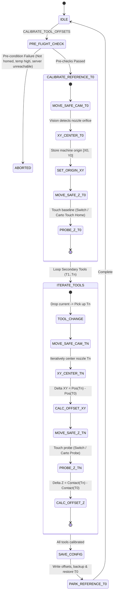

# WORKFLOW.md — Operational Workflow & Finite State Machine

> [!NOTE]
> Bản tiếng Việt có sẵn tại: [WORKFLOW.vi.md](WORKFLOW.vi.md)

---

## 1. Finite State Machine (FSM)

---

## 2. Detailed Execution Sequence

### Phase 1: Pre-Flight Safety Checks
1. **Homing Verification:** Checks that axes X, Y, and Z are homed (`'xyz' in printer.toolhead.homed_axes`). Aborts with `ERR_PRE_001` if unhomed.
2. **Thermal Safety:** Confirms all toolhead heaters are $\le 100^\circ\text{C}$ to avoid thermal expansion skew, optical refraction distortions, or melted filament drippings onto the camera lens.
3. **Service Connectivity:** Pings the Vision Service at `http://localhost:8090/health`. If unresponsive within 2.0 seconds, triggers `ERR_CAM_101`.
4. **Z-Backend Readiness:** Verifies switch pins or confirms Cartographer touch model is loaded in configuration.

### Phase 2: Reference Toolhead (T0) Alignment
1. Executes `before_pickup_gcode`, loads `T0`, executes `after_pickup_gcode`.
2. Transits to the Camera Station via the 3-tier safe trajectory:
   - Elevates Z to `Safe_Z`.
   - Moves laterally to `Safe_Approach_XY`.
   - Descends Z to optical focal plane `Target_Z`.
   - Slowly moves into optical center `Target_XY`.
3. Performs camera scaling calibration (computes mm-per-pixel `mpp` via star-pattern relative moves if uncalibrated).
4. Centers the nozzle orifice to image crosshairs. Records machine coordinates as $\text{Origin}_{XY} = [X_0, Y_0]$.
5. Elevates Z to `Safe_Z`, transits to Z Probe Station:
   - **Switch Backend:** Executes probe sample sequence, records $Z_{\text{Ref}} = Z_{\text{contact}}$.
   - **Cartographer Backend:** Executes `CARTOGRAPHER_TOUCH_HOME`, records $Z_{\text{Ref}} = 0.0$.

### Phase 3: Secondary Toolheads Iteration Loop (T1..Tn)
For each secondary toolhead `Tn`:
1. Elevates Z to `Safe_Z`. Releases previous tool and engages `Tn`.
2. Follows the safe approach trajectory into the Camera Station.
3. Centers nozzle `Tn` to optical center. Calculates XY offsets:
   $$\text{Offset}_X = X_n - X_0, \quad \text{Offset}_Y = Y_n - Y_0$$
4. Elevates Z to `Safe_Z`, moves safely to the Z Probe Station.
5. Executes probe sequence:
   - **Switch Backend:** Probes switch, computes $\text{Offset}_Z = Z_n - Z_{\text{Ref}}$.
   - **Cartographer Backend:** Executes `CARTOGRAPHER_TOUCH_PROBE`, computes $\text{Offset}_Z$ based on contact point and touch-model offset.
6. Caches measured offsets in volatile memory.

### Phase 4: Offset Persistence & Cleanup
1. Re-engages Reference Tool `T0` and parks at safe home position.
2. Automatically generates a timestamped backup of the target config file (see [BACKUP.md](BACKUP.md)).
3. Writes or updates `gcode_x_offset`, `gcode_y_offset`, `gcode_z_offset` in section `[tool n]` of `tool_offsets.cfg`.
4. Emits a comprehensive telemetry summary table to the Klipper console.

---

## 3. Contactless Dry-Run Mode
By executing `CALIBRATE_TOOL_OFFSETS DRY_RUN=1`:
- All toolchange commands, waypoint travel paths, and camera vision analyses execute normally.
- Z axis motions are offset to stop at least $5.0\text{mm}$ above all physical switches and bed surfaces.
- Configuration files remain untouched.
- Allows immediate visual verification of trajectory paths without hardware collision risks.
