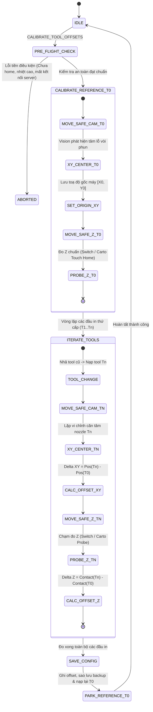

# WORKFLOW.vi.md — Quy Trình Hoạt Động & Finite State Machine

> [!NOTE]
> English version available at: [WORKFLOW.md](WORKFLOW.md)

---

## 1. Sơ Đồ Trạng Thái (Finite State Machine - FSM)

---

## 2. Trình Tự Thực Thi Chi Tiết

### Giai đoạn 1: Kiểm tra an toàn tiền điều kiện (Pre-flight Checks)
1. **Kiểm tra Homing:** Đảm bảo các trục X, Y, Z đã được về gốc (`'xyz' in printer.toolhead.homed_axes`). Báo lỗi `ERR_PRE_001` nếu chưa home.
2. **An toàn nhiệt độ:** Đảm bảo toàn bộ vòi phun có nhiệt độ $\le 100^\circ\text{C}$ nhằm tránh hiện tượng giãn nở nhiệt gây sai lệch quang học, tránh khói bốc mờ ống kính hoặc nhựa chảy nhỏ giọt vào mặt kính camera.
3. **Kiểm tra kết nối dịch vụ:** Gửi tín hiệu ping tới Vision Service tại `http://localhost:8090/health`. Nếu không nhận phản hồi trong 2.0 giây, kích hoạt lỗi `ERR_CAM_101`.
4. **Sẵn sàng Backend Z:** Kiểm tra chân tín hiệu công tắc switch hoặc kiểm tra touch model của Cartographer trong cấu hình.

### Giai đoạn 2: Căn chỉnh Đầu phun Tham chiếu (Reference Tool - T0)
1. Chạy hook `before_pickup_gcode`, nạp đầu in `T0`, chạy hook `after_pickup_gcode`.
2. Di chuyển đến Trạm Camera theo lộ trình an toàn 3 tầng:
   - Nâng Z lên mặt phẳng an toàn `Safe_Z`.
   - Di chuyển ngang XY đến điểm chờ tiếp cận `Safe_Approach_XY`.
   - Hạ Z xuống cao độ tiêu cự ống kính `Target_Z`.
   - Di chuyển chậm vào tâm tiêu cự `Target_XY`.
3. Đo kiểm tỷ lệ pixel-to-mm (tính toán hệ số `mpp` bằng chuyển động vi mô hình ngôi sao nếu chưa được hiệu chuẩn trước đó).
4. Dò tìm tâm lỗ vòi phun và căn giữa vào tâm chữ thập của ảnh. Ghi nhận toạ độ thực tế của máy in làm toạ độ gốc: $\text{Origin}_{XY} = [X_0, Y_0]$.
5. Nâng Z lên `Safe_Z`, di chuyển an toàn đến Trạm đo Z:
   - **Với Switch Backend:** Thực hiện chuỗi chạm lấy mẫu, ghi nhận $Z_{\text{Ref}} = Z_{\text{contact}}$.
   - **Với Cartographer Backend:** Chạy lệnh `CARTOGRAPHER_TOUCH_HOME`, ghi nhận $Z_{\text{Ref}} = 0.0$.

### Giai đoạn 3: Vòng lặp đo các Đầu phun Thứ cấp (T1..Tn)
Với mỗi đầu in thứ cấp `Tn`:
1. Nâng Z lên `Safe_Z`. Nhả đầu in hiện tại và nạp đầu in `Tn`.
2. Di chuyển theo lộ trình an toàn vào Trạm Camera.
3. Căn tâm vòi phun `Tn` trùng với tâm quang học. Tính toán độ lệch trục XY:
   $$\text{Offset}_X = X_n - X_0, \quad \text{Offset}_Y = Y_n - Y_0$$
4. Nâng Z lên `Safe_Z`, di chuyển an toàn tới Trạm đo Z.
5. Thực hiện chu trình probe:
   - **Với Switch Backend:** Chạm công tắc switch, tính $\text{Offset}_Z = Z_n - Z_{\text{Ref}}$.
   - **Với Cartographer Backend:** Chạy `CARTOGRAPHER_TOUCH_PROBE`, tính $\text{Offset}_Z$ dựa trên điểm tiếp xúc và thông số bù trừ của touch-model.
6. Lưu tạm thời các giá trị đo vào bộ nhớ đệm.

### Giai đoạn 4: Lưu trữ cấu hình & Hoàn tất
1. Nạp lại Đầu phun Tham chiếu `T0` và đưa về vị trí đỗ (park) an toàn.
2. Tự động tạo bản sao lưu có timestamp của file cấu hình mục tiêu (xem [BACKUP.vi.md](BACKUP.vi.md)).
3. Ghi mới hoặc cập nhật các dòng `gcode_x_offset`, `gcode_y_offset`, `gcode_z_offset` trong phần `[tool n]` của file `tool_offsets.cfg`.
4. Xuất bảng báo cáo tổng hợp kết quả chi tiết ra màn hình Klipper Console.

---

## 3. Chế Độ Thử Nghiệm Không Chạm (Dry-Run Mode)
Khi kích hoạt bằng lệnh `CALIBRATE_TOOL_OFFSETS DRY_RUN=1`:
- Toàn bộ lệnh đổi tool, lộ trình di chuyển qua các điểm an toàn và chụp ảnh phân tích thị giác máy vẫn diễn ra bình thường.
- Trục Z được khống chế dừng cách toàn bộ bề mặt công tắc và bàn in tối thiểu $5.0\text{mm}$ (không tiếp xúc cơ học).
- Tuyệt đối không can thiệp hay ghi đè vào các file cấu hình.
- Giúp người dùng quan sát thực tế và kiểm tra 100% đường chạy không có nguy cơ va chạm trước khi chạy chế độ đo thật.
