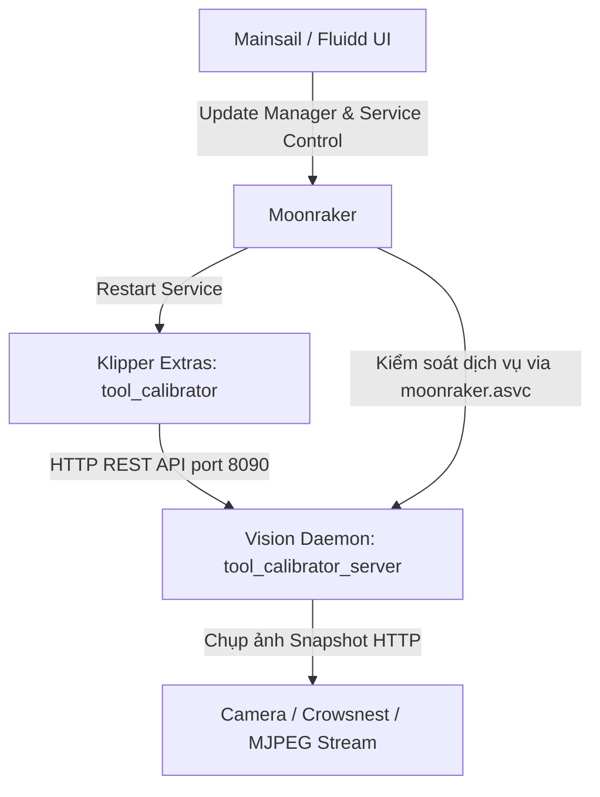

# HƯỚNG DẪN CÀI ĐẶT, TỰ ĐỘNG CẬP NHẬT VÀ GỠ BỎ
## Tool-Klipper-Calibration (Hệ Sinh Thái Klipper & Moonraker)

Tài liệu này cung cấp lộ trình chi tiết, chuẩn mực theo best practices của các dự án lớn trong hệ sinh thái Klipper (như Axiscope, kTAMV, Crowsnest) để cài đặt, cấu hình tự động cập nhật qua Moonraker Update Manager, và gỡ bỏ sạch sẽ **Tool-Klipper-Calibration**.

---

## 1. Tổng Quan Kiến Trúc Hệ Thống

Hệ thống hoạt động theo mô hình tích hợp 4 thành phần:



1. **Vision Daemon (`tool_calibrator_server.py`)**:
   - Chạy nền dưới dạng `systemd` service (`tool_calibrator.service`) trên máy chủ Klipper (Raspberry Pi, CB1, Orange Pi, PC Linux).
   - Sử dụng môi trường ảo Python cô lập (`~/Tool-Klipper-Calibration/env`) với OpenCV Headless siêu nhẹ và WSGI Waitress production server tại cổng `8090`.
2. **Klipper Module Extras (`klippy/extras/`)**:
   - Được liên kết tượng trưng (symlink) trực tiếp từ thư mục mã nguồn vào `~/klipper/klippy/extras/`:
     - `tool_calibrator.py`: Điều phối quy trình căn chỉnh tự động.
     - `tool_calibrator_station.py`: Quản lý trạm căn chỉnh, tính toán ma trận Affine 2D/3D.
     - `safe_navigator.py`: Định tuyến di chuyển an toàn đa đầu in, tránh va chạm giá đỡ.
     - `config_manager.py`: Lưu trữ offset và thông số vào cấu hình Klipper tự động.
     - `z_backends/`: Hỗ trợ đa cảm biến Z (`switch_backend.py`, `cartographer_backend.py`,...).
3. **Moonraker ASVC & Update Manager**:
   - Quản trị viên cập nhật trực tiếp 1-click từ Mainsail / Fluidd.
   - Khai báo phân quyền trong `moonraker.asvc` để Moonraker được phép restart daemon khi cập nhật mà không bị lỗi PolicyKit.

---

## 2. Lộ Trình Cài Đặt Từng Bước (Installation)

### Bước 2.1: Truy cập Terminal qua SSH
Kết nối SSH vào máy in của bạn (sử dụng tài khoản thông thường như `pi`, `btt`, `sovol`, v.v. **Tuyệt đối không dùng root**):
```bash
ssh pi@<dia_chi_ip_may_in>
```

### Bước 2.2: Clone mã nguồn từ GitHub
Tải mã nguồn về thư mục người dùng (`~`):
```bash
cd ~
git clone https://github.com/IDcrazy123/Tool-Klipper-Calibration.git
```

### Bước 2.3: Chạy script cài đặt tự động
Di chuyển vào thư mục dự án và thực thi installer:
```bash
cd ~/Tool-Klipper-Calibration
./scripts/install.sh
# Hoặc chế độ user-service (rootless, không cần quyền sudo):
# ./scripts/install.sh --user-service

# Hoặc nếu máy in tổ chức cấu hình theo thư mục con (ví dụ: Printer-Setup):
# ./scripts/install.sh --user-service --config-subdir Printer-Setup
```

**Bộ cài đặt sẽ tự động thực hiện:**
1. Kiểm tra môi trường hệ thống (ngăn ngừa chạy nhầm bằng `sudo`).
2. Kiểm tra các gói hệ thống cần thiết (`libgl1`, `libglib2.0-0`, `curl`) và khả năng tạo virtualenv.
3. Khởi tạo Python virtual environment độc lập tại `~/Tool-Klipper-Calibration/env`.
4. Cài đặt các thư viện xử lý ảnh: `opencv-python-headless`, `numpy`, `flask`, `waitress` với file constraints ổn định.
5. Tạo symlink các module Klipper extras vào `~/klipper/klippy/extras/` và symlink bộ macro vào thư mục cấu hình mục tiêu (`~/printer_data/config/[subdir/]tool_calibrator/`).
6. Khởi tạo sẵn tệp `tool_offsets.cfg` (ngăn lỗi `Include file does not exist` khi khởi động Klipper).
7. Cấu hình Moonraker (ASVC allowlist, khối `[update_manager tool_calibrator]`, hook tự động restart daemon khi update).
8. Đăng ký và kích hoạt dịch vụ `tool_calibrator.service` (hỗ trợ cả `--system-service` và `--user-service`).
9. Khởi động lại Klipper và Moonraker qua API hoặc systemd để nạp ngay các module mới.
10. Kiểm tra nghiêm ngặt phản hồi JSON từ endpoint `/health` trên cổng `8090`.

### Bước 2.4: Kiểm tra trạng thái dịch vụ sau khi cài
Kiểm tra xem Vision Server đã sẵn sàng nhận lệnh hay chưa:
```bash
curl -s http://127.0.0.1:8090/health
```
Kết quả mong đợi:
```json
{
  "status": "ok",
  "service": "tool_calibrator_server",
  "version": "v0.8.19",
  "commit": "6c721e5",
  "process_ready": true,
  "camera_ready": true,
  "scale_ready": false,
  "matrix_ready": false,
  "matrix_solved": false,
  "session_locked": false
}
```

Kiểm tra hoặc khởi động lại service:
```bash
# Đối với system service:
sudo systemctl status tool_calibrator.service
sudo systemctl restart tool_calibrator.service

# Đối với user service:
systemctl --user status tool_calibrator.service
systemctl --user restart tool_calibrator.service

# Hoặc dùng công cụ tích hợp tự nhận diện:
./scripts/restart_service.sh
```

---

## 3. Cấu Hình Klipper (`printer.cfg`) - Phong Cách 1-File kTAMV
Hệ thống hỗ trợ cơ chế nạp hợp nhất qua **đúng 1 file cấu hình duy nhất** (tương tự như kTAMV quản lý qua `ktamv.cfg`):

### Bước 3.1: Thêm dòng nạp duy nhất vào `printer.cfg`
Bạn chỉ cần thêm **đúng 1 dòng duy nhất** vào file `printer.cfg`:

```ini
[include tool_calibrator.cfg]
```
*(Hoặc `[include tool_calibrator/tool_calibrator.cfg]` nếu hệ thống máy in quản lý theo thư mục riêng).*

> **Khả năng tương thích ngược:**
> Nếu `printer.cfg` cũ của bạn vẫn còn chứa các dòng `[include ...tool_calibrator_macros.cfg]` hoặc `[include ...safe_staging_macros.cfg]`, hệ thống đã cấu hình các file này dưới dạng empty stub an toàn nên Klipper sẽ không bao giờ bị báo lỗi trùng lặp macro (`duplicate section error`).

### Bước 3.2: Tùy chỉnh thông số trong file `tool_calibrator.cfg`
Toàn bộ thông số và macros nằm trong file `tool_calibrator.cfg`:

```ini
[include tool_offsets.cfg]

[tool_calibrator]
service_url: http://127.0.0.1:8090
camera_stream_url: http://127.0.0.1:8080/?action=snapshot
offsets_config_path: ~/printer_data/config/tool_offsets.cfg
safe_z: 35.0                 # Độ cao an toàn vượt qua trạm/dock (mm)
force_safe_z: False          # Đặt True nếu muốn ép giá trị safe_z này ghi đè toạ độ đã lưu
travel_speed: 12000
approach_speed: 3000
z_backend: cartographer      # 'cartographer' (Cartographer Touch) hoặc 'switch' (công tắc cơ)

# ----------------------------------------------------------------------------
# Tùy chọn nâng cao khi z_backend là switch:
# ----------------------------------------------------------------------------
# probing_speed: 3.0
# lift_speed: 5.0
# samples: 3
# samples_tolerance: 0.010
# samples_retract_dist: 2.0
# switch_pin: ^PG12
```

> **Ghi chú về độ cao Safe Z:**
> - Bạn có thể dạy độ cao an toàn bằng lệnh `TEACH_CAMERA_SAFE_Z` (lấy toạ độ Z hiện tại) hoặc `TEACH_CAMERA_SAFE_Z Z=30` (đặt số cụ thể). Giá trị này sẽ được lưu vào `tool_offsets.cfg`.
> - Nếu bạn muốn giá trị `safe_z` trong file `tool_calibrator.cfg` luôn luôn có quyền ưu tiên cao nhất, chỉ cần đặt `force_safe_z: True`.

Sau khi sửa xong, nhấn **Save & Restart** Klipper.

---

## 4. Cấu Hình & Sử Dụng Moonraker Update Manager

### Bước 4.1: Khối cấu hình trong `moonraker.conf`
Script `install.sh` đã tự động thêm khối này. Nếu bạn muốn kiểm tra hoặc cấu hình thủ công, mở file `~/printer_data/config/moonraker.conf`:

```ini
[update_manager tool_calibrator]
type: git_repo
path: ~/Tool-Klipper-Calibration
origin: https://github.com/IDcrazy123/Tool-Klipper-Calibration.git
primary_branch: main
virtualenv: ~/Tool-Klipper-Calibration/env
requirements: server/requirements.txt
is_system_service: True
managed_services:
    tool_calibrator
    klipper
info_tags:
    desc=Tool-Klipper-Calibration Automated Vision & Z Alignment
```

### Bước 4.2: Tầm quan trọng của `moonraker.asvc`
Moonraker yêu cầu mọi dịch vụ bên thứ ba do người dùng quản lý phải nằm trong danh sách trắng (allowlist).
File `~/printer_data/moonraker.asvc` phải có dòng:
```text
tool_calibrator
```
*Nhờ đó, người dùng có thể Restart hoặc Stop dịch vụ Vision Server trực tiếp trên bảng điều khiển Service của Mainsail/Fluidd.*

### Bước 4.3: Cách Cập Nhật Bằng 1-Click
Khi có phiên bản mới trên GitHub:
1. Mở giao diện web **Mainsail** hoặc **Fluidd**.
2. Vào mục **Settings (Cài đặt)** -> **Update Manager (Quản lý cập nhật)**.
3. Bạn sẽ thấy mục `tool_calibrator` hiển thị trạng thái commit.
4. Nhấn nút **Update** (hoặc **Update All**):
   - Moonraker sẽ tự động `git pull` mã nguồn mới nhất.
   - Tự động kích hoạt virtualenv cập nhật thư viện python nếu `server/requirements.txt` có thay đổi.
   - Tự động khởi động lại `tool_calibrator.service` và `klipper.service`.

### Bước 4.4: Tối Ưu Tốc Độ Cập Nhật (Khắc phục Treo / Chờ lâu ở "Updating Repo...")
Nếu bạn thấy quá trình cập nhật bị dừng lâu (30s – 2 phút) ở dòng:
`Git Repo tool_calibrator: Updating Repo...`

**Nguyên nhân gốc rễ**:
1. **Trễ DNS / IPv6 Timeout đến GitHub**: Mạng gia đình tại Việt Nam (Viettel, FPT, VNPT) thường cấp phát IPv6 nội bộ nhưng đường truyền quốc tế đi GitHub CDN qua IPv6 hay bị drop gói tin. Hệ thống Linux (Debian) trên Pi sẽ thử kết nối qua IPv6 và phải chờ timeout 30-60 giây trước khi tự động chuyển sang IPv4.
2. **Thắt nút I/O thẻ nhớ SD**: Thẻ nhớ Raspberry Pi có tốc độ ghi ngẫu nhiên (random 4K) chậm. Khi repo tích lũy loose objects, lệnh kiểm tra git sẽ ngốn I/O thẻ nhớ.

**Cách xử lý triệt để (Chạy 1 lần duy nhất qua SSH trên Raspberry Pi)**:
```bash
# 1. Ép hệ thống ưu tiên kết nối IPv4 (Khắc phục triệt để trễ timeout kết nối GitHub):
sudo sed -i 's/^#precedence ::ffff:0:0\/96  100/precedence ::ffff:0:0\/96  100/' /etc/gai.conf || echo "precedence ::ffff:0:0/96  100" | sudo tee -a /etc/gai.conf

# 2. Tối ưu bộ đệm truyền gói tin Git và giao thức HTTP/1.1:
git config --global http.version HTTP/1.1
git config --global http.postBuffer 524288000

# 3. Nén gọn Git Repository trên máy in để giảm I/O thẻ nhớ:
cd ~/Tool-Klipper-Calibration && git gc --prune=now
```

**Mẹo Cập nhật Nhanh Cực tốc (Chỉ mất 2 giây qua SSH)**:
Trong quá trình thử nghiệm hoặc căn chỉnh thường xuyên, bạn có thể chạy lệnh 1 dòng trực tiếp qua terminal thay vì chờ web:
```bash
cd ~/Tool-Klipper-Calibration && git pull && sudo systemctl restart tool_calibrator && sudo systemctl restart klipper
```
*(Nếu cài đặt ở chế độ user-service, thay `sudo systemctl` bằng `systemctl --user`).*

---

## 5. Quy Trình Gỡ Bỏ Sạch Sẽ (Clean Uninstallation & Reinstallation)

Do Tool-Klipper-Calibration đã chuyển đổi hoàn toàn sang **cấu trúc 1 file cấu hình duy nhất** (`tool_calibrator.cfg`), việc gỡ sạch sẽ toàn bộ thư mục git clone cũ và các thư mục backup cũ là rất quan trọng để tránh tình trạng cài lại nhưng vẫn ăn vào bản cũ hoặc lỗi `destination path already exists`.

### Bước 5.1: Chạy script gỡ cài đặt sạch sẽ

```bash
cd ~/Tool-Klipper-Calibration

# Cách 1: Chạy chế độ tương tác (mặc định nhấn Enter chọn [Y] để gỡ sạch sẽ cả repo và backup):
./scripts/uninstall.sh

# Cách 2: Gỡ sạch toàn bộ tự động trong 1 lệnh (khuyên dùng khi muốn cài lại mới hoàn toàn):
./scripts/uninstall.sh --purge-all
# (Hoặc: ./scripts/uninstall.sh --clean hoặc ./scripts/uninstall.sh -a)

# Nếu máy in sử dụng thư mục con cấu hình (ví dụ Printer-Setup):
./scripts/uninstall.sh --purge-all --config-subdir Printer-Setup

# Nếu muốn giữ lại file toạ độ tool_offsets.cfg:
./scripts/uninstall.sh --keep-data
```

**Script gỡ cài đặt sẽ thực hiện:**
1. Dừng và vô hiệu hóa `tool_calibrator.service` (hỗ trợ cả system và user mode).
2. Gỡ bỏ an toàn các symlinks của TKC trong `~/klipper/klippy/extras/` (tuyệt đối không đụng chạm module khác).
3. Gỡ bỏ toàn bộ macro cũ (`macros.cfg`, `safe_staging_macros.cfg`, `tool_calibrator_macros.cfg`).
4. Tự động vô hiệu hóa (thêm comment `#`) các dòng `[include ...]` cũ trong `printer.cfg` (kèm sao lưu an toàn) để Klipper không bị lỗi startup do thiếu file macro cũ.
5. Xóa sạch các thư mục và file backup cũ (`printer_data/config/config_backups/tkc_*`, `*.calib_backup_*`, `*.archived_*`, `*.uninstall.bak_*`).
6. Dọn dẹp cấu hình trong `moonraker.conf` và `moonraker.asvc`.
7. Khởi động lại dịch vụ Klipper và Moonraker để nạp trạng thái sạch.
8. Xóa sạch hoàn toàn thư mục clone git (`~/Tool-Klipper-Calibration`) khi chọn gỡ repo, giải phóng đường dẫn để sẵn sàng `git clone` mới.

### Bước 5.2: Cài đặt lại phiên bản mới nhất từ đầu

Sau khi gỡ sạch, tiến hành cài đặt lại theo quy trình chuẩn:

```bash
# 1. Chuyển về thư mục người dùng
cd ~

# 2. Clone mã nguồn mới nhất từ GitHub
git clone https://github.com/IDcrazy123/Tool-Klipper-Calibration.git

# 3. Chạy script cài đặt
cd Tool-Klipper-Calibration
./scripts/install.sh
# Hoặc với thư mục con: ./scripts/install.sh --config-subdir Printer-Setup
```

> **Tính năng tự động đồng bộ (Auto Git Sync):** Ngay cả khi bạn chạy `./scripts/install.sh` trong thư mục cũ, script sẽ tự động kiểm tra trên GitHub, nếu phát hiện commit mới hơn trên `origin/main`, script sẽ tự động hỏi và `git pull` bản mới nhất về trước khi cài đặt.

### Bước 5.3: Cấu hình Klipper (Chỉ 1 dòng duy nhất!)

Sau khi cài đặt xong, bạn chỉ cần khai báo **DUY NHẤT 1 DÒNG** trong `printer.cfg`:

```ini
[include tool_calibrator/tool_calibrator.cfg]
# Hoặc nếu dùng thư mục con:
# [include Printer-Setup/tool_calibrator/tool_calibrator.cfg]
```
*(Toàn bộ macros, safe Z, cấu hình camera và Z-probing đã được tích hợp tập trung vào file này, gom gọn gàng trong thư mục `tool_calibrator/` mà không để file thừa bên ngoài)*.

---

## 6. Xử Lý Sự Cố Thường Gặp (Troubleshooting)

### 1. Vision Server không chạy / Lỗi cổng 8090
- **Hiện tượng:** Lệnh `curl http://127.0.0.1:8090/health` báo `Connection refused`.
- **Cách xử lý:**
  Kiểm tra log chi tiết:
  ```bash
  journalctl -u tool_calibrator.service -n 50 --no-pager
  ```
  Nếu trùng cổng 8090 với một dịch vụ khác, bạn có thể chỉnh tham số `--port <cổng_mới>` trong file `/etc/systemd/system/tool_calibrator.service`, sau đó chạy `sudo systemctl daemon-reload && sudo systemctl restart tool_calibrator`. Đồng thời sửa `server_url` trong `printer.cfg`.

### 2. Moonraker báo "Permission Denied" khi cập nhật hoặc khởi động lại
- **Hiện tượng:** Nhấn Update hoặc restart trên Mainsail báo lỗi phân quyền policykit.
- **Cách xử lý:**
  Đảm bảo dòng `tool_calibrator` đã có trong file `~/printer_data/moonraker.asvc`:
  ```bash
  echo "tool_calibrator" >> ~/printer_data/moonraker.asvc
  sudo systemctl restart moonraker
  ```

### 3. Klipper báo lỗi "Unknown pin" hoặc "Section not found"
- **Hiện tượng:** Klipper dừng khẩn cấp khi khởi động.
- **Cách xử lý:**
  - Kiểm tra xem các symlink đã có trong `~/klipper/klippy/extras/` hay chưa:
    ```bash
    ls -l ~/klipper/klippy/extras/tool_calibrator*
    ```
  - Khởi động lại Klipper: `sudo systemctl restart klipper`.
