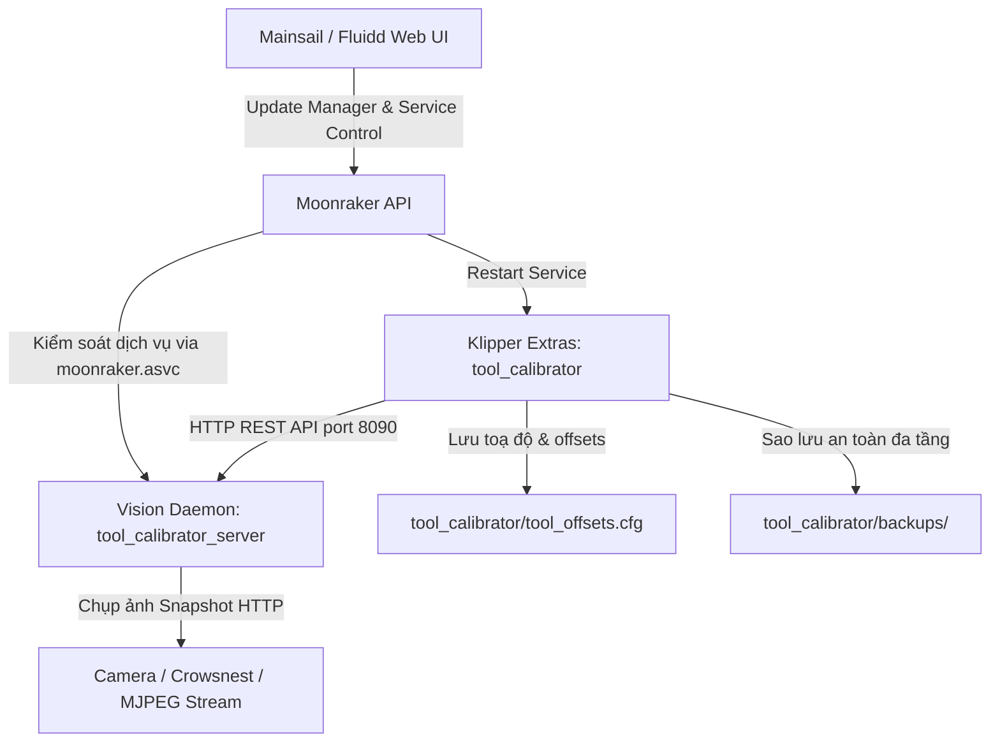

# HƯỚNG DẪN CÀI ĐẶT, CẬP NHẬT VÀ GỠ BỎ CHUẨN MỰC
## Tool-Klipper-Calibration (Hệ Sinh Thái Klipper & Moonraker)

Tài liệu này cung cấp lộ trình chi tiết, chuẩn mực theo best practices của các dự án lớn trong hệ sinh thái Klipper (như Axiscope, kTAMV, Crowsnest) để cài đặt, cấu hình cập nhật qua Moonraker Update Manager, quản lý thư mục cấu hình cô lập và gỡ bỏ sạch sẽ **Tool-Klipper-Calibration (TKC)**.

---

## 1. Tổng Quan Kiến Trúc Hệ Thống

Hệ thống hoạt động theo mô hình tích hợp Client - Server độc lập, đảm bảo an toàn tuyệt đối cho tiến trình điều khiển chuyển động của Klipper:



### Các thành phần chính:
1. **Vision Daemon (`tool_calibrator_server.py`)**:
   - Chạy nền dưới dạng `systemd` service (`tool_calibrator.service`) trên máy chủ Klipper (Raspberry Pi, CB1, Orange Pi, PC Linux).
   - Sử dụng môi trường ảo Python cô lập (`~/Tool-Klipper-Calibration/env`) với OpenCV Headless siêu nhẹ và WSGI Waitress production server tại cổng `8090`.
   - Xử lý toàn bộ thuật toán thị giác máy tính nặng tách rời khỏi tiến trình Klipper chính, loại bỏ 100% nguy cơ trễ nhịp reactor (`Timer too close`).

2. **Klipper Module Extras (`klippy/extras/`)**:
   - Được liên kết tượng trưng (symlink) trực tiếp từ thư mục mã nguồn vào `~/klipper/klippy/extras/`:
     - `tool_calibrator.py`: Điều phối toàn bộ quy trình căn chỉnh tự động.
     - `tool_calibrator_station.py`: Quản lý trạm quang học, giải ma trận chuyển đổi Affine 2D.
     - `safe_navigator.py`: Định tuyến di chuyển an toàn 3 tầng (`Safe_Z`, `Safe_Approach`, `Target`).
     - `config_manager.py`: Giao dịch ghi offset và sao lưu cấu hình tự động.
     - `z_backends/`: Module hỗ trợ đa cảm biến Z (`cartographer_backend.py`, `switch_backend.py`).

3. **Cấu trúc Thư mục Cô lập Duy nhất (100% trong `tool_calibrator/`)**:
   - Toàn bộ cấu hình, toạ độ học và bản sao lưu (backup) được gom gọn duy nhất trong:
     `~/printer_data/config/tool_calibrator/`
     - `tool_calibrator.cfg`: Tệp cấu hình master (tệp thực tế có quyền ghi `chmod 664`, chỉnh sửa thoải mái trên Mainsail/Fluidd).
     - `tool_offsets.cfg`: Tệp tự động ghi toạ độ trạm và offset của các đầu phun.
     - `backups/`: Thư mục tập trung chứa toàn bộ lịch sử sao lưu:
       - `backups/calibration_offsets/`: Lưu trữ các bản backup toạ độ offset trước mỗi lần cân chỉnh mới (tự xoay vòng tối đa 10 bản).
       - `backups/system_configs/`: Lưu trữ cấu hình hệ thống (`printer.cfg`) khi gỡ bỏ hoặc bảo trì.
   - **Tuyệt đối không sinh bất kỳ thư mục hay file nào bên ngoài thư mục `tool_calibrator/`**.

4. **Moonraker Update Manager & ASVC**:
   - Quản lý cập nhật trực tiếp 1-click từ giao diện Mainsail / Fluidd.
   - Phân quyền dịch vụ an toàn qua `moonraker.asvc` để Moonraker được phép restart daemon mà không phát sinh lỗi PolicyKit.

---

## 2. Lộ Trình Cài Đặt Từng Bước (Installation SOP)

### Bước 2.1: Truy cập Terminal qua SSH
Kết nối SSH vào máy in của bạn bằng tài khoản người dùng thông thường (ví dụ: `pi`, `btt`, `voron`, `sovol`... **Tuyệt đối không đăng nhập bằng root**):
```bash
ssh pi@<dia_chi_ip_may_in>
```

### Bước 2.2: Clone mã nguồn từ GitHub
Tải mã nguồn về thư mục người dùng (`~`):
```bash
cd ~
git clone https://github.com/IDcrazy123/Tool-Klipper-Calibration.git
```

### Bước 2.3: Chạy script cài đặt tự động
Di chuyển vào thư mục dự án và thực thi installer:
```bash
cd ~/Tool-Klipper-Calibration
./scripts/install.sh
```

#### Các tuỳ chọn nâng cao khi cài đặt:
- **Chế độ User-Service (Rootless - không cần quyền sudo)**:
  ```bash
  ./scripts/install.sh --user-service
  ```
- **Máy in sử dụng thư mục con cấu hình (ví dụ: Printer-Setup)**:
  ```bash
  ./scripts/install.sh --config-subdir Printer-Setup
  ```

#### Bộ cài đặt sẽ tự động thực hiện các bước:
1. **Kiểm tra môi trường & quyền hạn**: Chặn không cho chạy trực tiếp bằng `sudo/root` để đảm bảo quyền sở hữu tệp chuẩn xác.
2. **Kiểm tra & Cập nhật Git**: Tự động đối chiếu với GitHub; nếu có commit mới hơn sẽ nhắc người dùng cập nhật ngay.
3. **Cài đặt thư viện hệ thống**: Cài đặt `libgl1`, `libglib2.0-0`, `curl` nếu hệ thống còn thiếu.
4. **Khởi tạo Virtualenv độc lập**: Tạo môi trường ảo tại `~/Tool-Klipper-Calibration/env` và cài đặt `opencv-python-headless`, `numpy`, `flask`, `waitress` với file constraints tối ưu.
5. **Cài đặt Klipper Module Extras**: Tạo symlink chuẩn xác từ mã nguồn vào `~/klipper/klippy/extras/`.
6. **Thiết lập thư mục cấu hình cô lập**:
   - Tạo thư mục `~/printer_data/config/tool_calibrator/`.
   - Sao chép `tool_calibrator.cfg` dưới dạng **tệp thực tế có quyền ghi (`chmod 664`)**, giúp bạn có thể mở và chỉnh sửa trực tiếp trên giao diện web Mainsail / Fluidd mà không bị lỗi tệp chỉ đọc (Read-only).
   - Khởi tạo sẵn tệp `tool_offsets.cfg` trống ban đầu để Klipper không bị lỗi khởi động `Include file does not exist`.
   - Tự động dọn dẹp các tệp macro rải rác cũ (`safe_staging_macros.cfg`, `tool_calibrator_macros.cfg`, `macros.cfg`).
7. **Phân quyền Moonraker ASVC**: Tự động thêm `tool_calibrator` vào `~/printer_data/moonraker.asvc`.
8. **Đăng ký Systemd Service**: Khởi tạo và kích hoạt `tool_calibrator.service` chạy tự động cùng hệ thống.
9. **Kiểm tra trạng thái `/health`**: Đảm bảo Vision Server phản hồi JSON `status: ok` tại cổng 8090 trước khi hoàn tất.

---

### Bước 2.4: Kiểm tra trạng thái dịch vụ sau khi cài
Kiểm tra xem Vision Server đã phản hồi sẵn sàng nhận lệnh hay chưa:
```bash
curl -s http://127.0.0.1:8090/health
```

Kết quả phản hồi chuẩn JSON:
```json
{
  "status": "ok",
  "service": "tool_calibrator_server",
  "version": "v0.8.20",
  "commit": "ae8298c",
  "process_ready": true,
  "camera_ready": true,
  "scale_ready": false,
  "matrix_ready": false,
  "matrix_solved": false,
  "session_locked": false
}
```

Kiểm tra trạng thái systemd service:
```bash
# Đối với system service (mặc định):
sudo systemctl status tool_calibrator.service

# Đối với user service (nếu cài qua --user-service):
systemctl --user status tool_calibrator.service
```

---

## 3. Khai Báo Trong `printer.cfg` (Phong Cách 1 Dòng Duy Nhất)

Sau khi cài đặt xong, bạn chỉ cần mở file `printer.cfg` và thêm **DUY NHẤT 1 DÒNG** ở vị trí các dòng include:

```ini
[include tool_calibrator/tool_calibrator.cfg]
```
*(Nếu máy in của bạn quản lý theo thư mục con như `Printer-Setup`, dòng khai báo sẽ là: `[include Printer-Setup/tool_calibrator/tool_calibrator.cfg]`)*.

> [!TIP]
> **Tự Động Vô Hiệu Hóa Include Cũ:**
> Bộ cài đặt `install.sh` đã tự động thêm comment vô hiệu hóa các dòng include macro cũ (`safe_staging_macros.cfg`, `tool_calibrator_macros.cfg`) trong `printer.cfg` của bạn để tránh lỗi xung đột hoặc thiếu file.

### Tùy chỉnh thông số trong `tool_calibrator/tool_calibrator.cfg`
Mọi thông số, tốc độ, phương thức đo Z và các macro điều khiển đều được gom trọn vẹn trong file `tool_calibrator/tool_calibrator.cfg`:

```ini
# Tự động nạp toạ độ trạm & offsets đã học
[include tool_offsets.cfg]

[tool_calibrator]
# 1. KẾT NỐI VISION SERVICE & CAMERA
service_url: http://127.0.0.1:8090
camera_stream_url: http://127.0.0.1:8080/?action=snapshot
offsets_config_path: ~/printer_data/config/tool_calibrator/tool_offsets.cfg

# 2. ĐỘ CAO AN TOÀN (SAFE_Z) & TÍNH NĂNG BỨT TỐC CARTOGRAPHER TOUCH
# - Mặc định khi để comment (#): Cartographer Touch tự động bứt tốc (safe_z = 0.0)
# - Bỏ comment (#) và nhập số: Hệ thống sẽ lập tức tuân thủ đúng số đã khai báo
# safe_z: 35.0
# force_safe_z: False

# 3. TỐC ĐỘ DI CHUYỂN
travel_speed: 12000          # Tốc độ di chuyển nhanh giữa các trạm (mm/min)
approach_speed: 1500         # Tốc độ tiếp cận chậm chính xác (mm/min)
z_speed: 600                 # Tốc độ trục Z (mm/min)

# 4. Z BACKEND (Cơ chế Dò Độ Cao Trục Z)
# 'cartographer': Dùng Cartographer Touch (vòi phun chạm trực tiếp bàn in)
# 'switch': Dùng công tắc cơ khí chạm đầu phun (PF2 switch / Axiscope pin)
z_backend: cartographer

# 5. CẤU HÌNH THỊ GIÁC & LẤY MẪU
centering_samples: 3         # Số frame lấy mẫu mỗi bước căn chỉnh (1-7)
sample_delay: 0.08           # Khoảng cách giữa các frame (giây)
wiggle_distance: 0.10        # Biên độ dịch chuyển vi mô phá lóa sáng (mm)
wiggle_on_failure: True      # Bật tự động lắc vi mô khi mất dấu đầu phun
max_camera_temp: 100.0       # Giới hạn nhiệt độ an toàn bảo vệ ống kính (°C)
```

> [!IMPORTANT]
> **Tính Năng Bứt Tốc Mặc Định Cartographer Touch:**
> Khi sử dụng **Cartographer Touch** (`z_backend: cartographer`), bạn chỉ cần **để comment (hoặc để trống)** 2 dòng `# safe_z` và `# force_safe_z`. Hệ thống sẽ **MẶC ĐỊNH TỰ ĐỘNG BỨT TỐC** (`safe_z = 0.0`), bỏ qua hoàn toàn thao tác nâng hạ trục Z thừa thãi giữa các lần chạm bàn in. Đầu phun sẽ bay thẳng ngang XY ở cao độ hiện tại tới điểm đo cực nhanh và mượt mà.
> Nếu muốn nâng trục Z lên một độ cao an toàn cố định (ví dụ máy in có kẹp bàn hoặc chướng ngại vật), bạn chỉ việc bỏ dấu `#` và khai báo số cụ thể (ví dụ `safe_z: 35.0`), hệ thống sẽ lập tức nhận lệnh theo con số đã khai báo đó!

Sau khi lưu cấu hình, nhấn **Save & Restart** Klipper trên giao diện web.

---

## 4. Cấu Hình Moonraker Update Manager

Để giữ cho thư mục cấu hình luôn sạch sẽ và **tránh việc Moonraker tự động tạo ra các tệp sao lưu thừa (`moonraker.conf.bak_*`)**, script `install.sh` không tự ý sửa file `moonraker.conf`. Thay vào đó, bạn chỉ cần dán khối cấu hình chuẩn bên dưới vào cuối file `~/printer_data/config/moonraker.conf`:

### Bước 4.1: Dán khối cấu hình vào `moonraker.conf`

**Đối với cài đặt System Service mặc định:**
```ini
[update_manager tool_calibrator]
type: git_repo
path: ~/Tool-Klipper-Calibration
origin: https://github.com/IDcrazy123/Tool-Klipper-Calibration.git
primary_branch: main
virtualenv: ~/Tool-Klipper-Calibration/env
requirements: server/requirements.txt
is_system_service: True
managed_services:
    tool_calibrator
    klipper
info_tags:
    desc=Tool-Klipper-Calibration Automated Vision & Z Alignment
```

*(Nếu bạn cài đặt bằng cờ `--user-service`, thay `is_system_service: True` thành `is_system_service: False` và thêm dòng `install_script: scripts/update_hook.sh`)*.

### Bước 4.2: Khởi động lại Moonraker
Lưu file và khởi động lại Moonraker trên giao diện web hoặc qua terminal:
```bash
sudo systemctl restart moonraker
```

### Bước 4.3: Cách Cập Nhật 1-Click Trên Web UI
1. Mở giao diện **Mainsail** hoặc **Fluidd**.
2. Vào mục **Settings (Cài đặt)** -> **Update Manager (Quản lý cập nhật)**.
3. Mục `tool_calibrator` sẽ hiển thị phiên bản hiện tại và trạng thái commit trên GitHub.
4. Khi có bản cập nhật mới, chỉ cần nhấn nút **Update**:
   - Moonraker sẽ tự động `git pull` mã nguồn mới nhất.
   - Tự động cập nhật thư viện python trong `env` nếu file requirements có thay đổi.
   - Tự động khởi động lại `tool_calibrator.service` và `klipper.service`.

### Bước 4.4: Tối Ưu Tốc Độ Cập Nhật (Khắc phục Chờ lâu ở "Updating Repo...")
Nếu bạn thấy quá trình cập nhật qua web bị dừng lâu (30 giây – 2 phút) ở dòng `Git Repo tool_calibrator: Updating Repo...`:

**Nguyên nhân gốc rễ**: Các nhà mạng tại Việt Nam (Viettel, FPT, VNPT) thường cấp phát IPv6 nội bộ nhưng đường truyền quốc tế đi GitHub CDN qua IPv6 hay bị rớt gói. Hệ điều hành Linux trên Raspberry Pi sẽ thử kết nối qua IPv6 và phải chờ timeout trước khi tự động chuyển sang IPv4.

**Khắc phục triệt để (Chạy 1 lần duy nhất qua SSH trên Raspberry Pi)**:
```bash
# 1. Ép hệ thống ưu tiên kết nối IPv4 (Khắc phục triệt để trễ timeout kết nối GitHub):
sudo sed -i 's/^#precedence ::ffff:0:0\/96  100/precedence ::ffff:0:0\/96  100/' /etc/gai.conf || echo "precedence ::ffff:0:0/96  100" | sudo tee -a /etc/gai.conf

# 2. Tối ưu bộ đệm truyền gói tin Git và giao thức HTTP/1.1:
git config --global http.version HTTP/1.1
git config --global http.postBuffer 524288000

# 3. Nén gọn Git Repository trên máy in để giảm I/O thẻ nhớ:
cd ~/Tool-Klipper-Calibration && git gc --prune=now
```

**Mẹo Cập Nhật Nhanh Cực Tốc (Chỉ 2 giây qua SSH)**:
Khi đang thử nghiệm hoặc cần cập nhật tức thì, bạn có thể chạy 1 dòng lệnh duy nhất qua SSH:
```bash
cd ~/Tool-Klipper-Calibration && git pull && sudo systemctl restart tool_calibrator && sudo systemctl restart klipper
```

---

## 5. Quy Trình Gỡ Bỏ Sạch Sẽ & Cài Đặt Lại (Clean Uninstallation)

Khi muốn gỡ cài đặt hoàn toàn hoặc cài lại mới từ đầu sau các đợt nâng cấp kiến trúc lớn, việc dọn dẹp sạch sẽ toàn bộ thư mục clone git và các thư mục backup cũ là rất quan trọng để tránh lỗi xung đột đường dẫn hoặc máy in vô tình nạp file macro cũ.

### Bước 5.1: Chạy script gỡ cài đặt sạch sẽ
```bash
cd ~/Tool-Klipper-Calibration
./scripts/uninstall.sh
```

#### Chế độ tương tác (Interactive Mode):
Script sẽ hỏi bạn 3 câu hỏi trực quan (nhấn `Y` hoặc bấm `Enter` để đồng ý):
1. *Xóa sạch thư mục và file sao lưu cũ?*
2. *Gỡ bỏ toàn bộ file cấu hình TKC cũ trong thư mục config máy in?*
3. *Xóa sạch thư mục mã nguồn git clone sau khi gỡ để sẵn sàng `git clone` mới?*

#### Chế độ tự động 1 lệnh duy nhất (Khuyên dùng khi muốn cài lại mới hoàn toàn):
```bash
./scripts/uninstall.sh --purge-all
```
*(Cờ `--purge-all` sẽ tự động dọn sạch thư mục git clone, gỡ toàn bộ cấu hình, xóa sạch các bản backup cũ và phục hồi `printer.cfg`, `moonraker.conf` về trạng thái nguyên bản)*.

#### Các cờ tùy chọn khác:
- `--keep-data`: Gỡ phần mềm nhưng giữ nguyên tệp toạ độ `tool_offsets.cfg`.
- `--purge-repo`: Chỉ xóa thư mục clone git sau khi gỡ service và symlink.
- `--config-subdir <subdir>`: Chỉ định thư mục con (ví dụ: `Printer-Setup`).

### Bước 5.2: Cài đặt lại phiên bản mới nhất từ đầu
Sau khi chạy `./scripts/uninstall.sh --purge-all`, toàn bộ hệ thống đã sạch sẽ. Bạn có thể cài lại từ đầu theo đúng chuẩn:

```bash
# 1. Chuyển về thư mục người dùng
cd ~

# 2. Clone mã nguồn mới nhất từ GitHub
git clone https://github.com/IDcrazy123/Tool-Klipper-Calibration.git

# 3. Chạy script cài đặt
cd Tool-Klipper-Calibration
./scripts/install.sh
```

### Bước 5.3: Thêm lại dòng include vào `printer.cfg`
Thêm đúng 1 dòng duy nhất vào `printer.cfg`:
```ini
[include tool_calibrator/tool_calibrator.cfg]
```
Và dán khối `[update_manager tool_calibrator]` vào `moonraker.conf` như hướng dẫn tại Mục 4.

---

## 6. Xử Lý Sự Cố Thường Gặp (Troubleshooting)

### 1. File `tool_calibrator.cfg` bị báo "Read-only" không cho lưu trên Mainsail/Fluidd
- **Nguyên nhân**: Ở các phiên bản cũ, file cấu hình được tạo dưới dạng liên kết tượng trưng (symlink) trỏ vào thư mục git repo, khiến trình duyệt web của Klipper áp đặt trạng thái chỉ đọc để bảo vệ.
- **Cách xử lý**:
  Chạy lại script cài đặt bản mới:
  ```bash
  cd ~/Tool-Klipper-Calibration && git pull && ./scripts/install.sh
  ```
  Script bản mới đã tự động chuyển đổi symlink thành file thực tế với quyền ghi `chmod 664`, cho phép chỉnh sửa và lưu trực tiếp trên Mainsail/Fluidd.

### 2. Lỗi `Include file '.../tool_offsets.cfg' does not exist`
- **Nguyên nhân**: Klipper khởi động trước khi file offset được tạo ra.
- **Cách xử lý**:
  Bộ cài đặt `install.sh` hiện tại đã tự động tạo sẵn file `tool_offsets.cfg` ban đầu trong thư mục `tool_calibrator/`. Nếu bạn vô tình xóa, chỉ cần tạo lại bằng lệnh:
  ```bash
  touch ~/printer_data/config/tool_calibrator/tool_offsets.cfg
  ```

### 3. Moonraker báo lỗi "Permission Denied" khi cập nhật hoặc restart service
- **Nguyên nhân**: Dịch vụ `tool_calibrator` chưa được cấp phép trong Moonraker ASVC allowlist.
- **Cách xử lý**:
  Đảm bảo file `~/printer_data/moonraker.asvc` có chứa dòng `tool_calibrator`:
  ```bash
  echo "tool_calibrator" >> ~/printer_data/moonraker.asvc
  sudo systemctl restart moonraker
  ```

### 4. Vision Server không phản hồi cổng 8090 (`Connection refused`)
- **Cách xử lý**:
  Kiểm tra nhật ký hoạt động của service:
  ```bash
  journalctl -u tool_calibrator.service -n 50 --no-pager
  ```
  Nếu bị trùng cổng 8090 với dịch vụ khác trên máy in, bạn có thể chỉnh tham số `--port <cổng_mới>` trong file `/etc/systemd/system/tool_calibrator.service`, sau đó chạy:
  ```bash
  sudo systemctl daemon-reload && sudo systemctl restart tool_calibrator.service
  ```
  Và cập nhật lại `service_url` tương ứng trong `tool_calibrator/tool_calibrator.cfg`.
