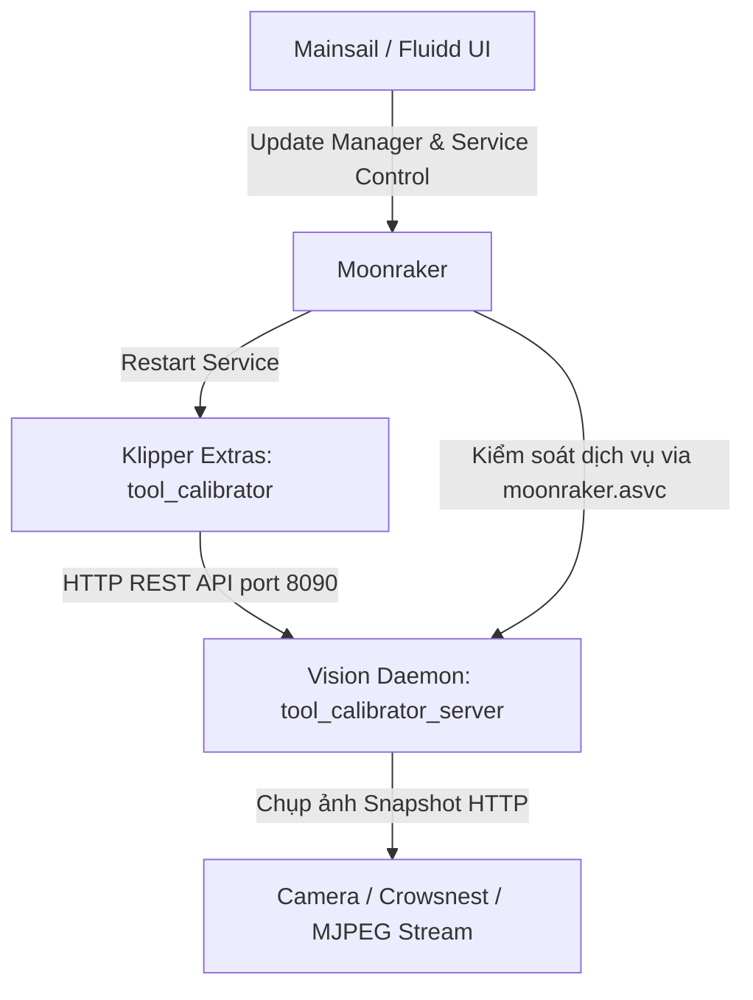

# HƯỚNG DẪN CÀI ĐẶT, TỰ ĐỘNG CẬP NHẬT VÀ GỠ BỎ
## Tool-Klipper-Calibration (Hệ Sinh Thái Klipper & Moonraker)

Tài liệu này cung cấp lộ trình chi tiết, chuẩn mực theo best practices của các dự án lớn trong hệ sinh thái Klipper (như Axiscope, kTAMV, Crowsnest) để cài đặt, cấu hình tự động cập nhật qua Moonraker Update Manager, và gỡ bỏ sạch sẽ **Tool-Klipper-Calibration**.

---

## 1. Tổng Quan Kiến Trúc Hệ Thống

Hệ thống hoạt động theo mô hình tích hợp 4 thành phần:



1. **Vision Daemon (`tool_calibrator_server.py`)**:
   - Chạy nền dưới dạng `systemd` service (`tool_calibrator.service`) trên máy chủ Klipper (Raspberry Pi, CB1, Orange Pi, PC Linux).
   - Sử dụng môi trường ảo Python cô lập (`~/Tool-Klipper-Calibration/env`) với OpenCV Headless siêu nhẹ và WSGI Waitress production server tại cổng `8090`.
2. **Klipper Module Extras (`klippy/extras/`)**:
   - Được liên kết tượng trưng (symlink) trực tiếp từ thư mục mã nguồn vào `~/klipper/klippy/extras/`:
     - `tool_calibrator.py`: Điều phối quy trình căn chỉnh tự động.
     - `tool_calibrator_station.py`: Quản lý trạm căn chỉnh, tính toán ma trận Affine 2D/3D.
     - `safe_navigator.py`: Định tuyến di chuyển an toàn đa đầu in, tránh va chạm giá đỡ.
     - `config_manager.py`: Lưu trữ offset và thông số vào cấu hình Klipper tự động.
     - `z_backends/`: Hỗ trợ đa cảm biến Z (`switch_backend.py`, `cartographer_backend.py`,...).
3. **Moonraker ASVC & Update Manager**:
   - Quản trị viên cập nhật trực tiếp 1-click từ Mainsail / Fluidd.
   - Khai báo phân quyền trong `moonraker.asvc` để Moonraker được phép restart daemon khi cập nhật mà không bị lỗi PolicyKit.

---

## 2. Lộ Trình Cài Đặt Từng Bước (Installation)

### Bước 2.1: Truy cập Terminal qua SSH
Kết nối SSH vào máy in của bạn (sử dụng tài khoản thông thường như `pi`, `btt`, `sovol`, v.v. **Tuyệt đối không dùng root**):
```bash
ssh pi@<dia_chi_ip_may_in>
```

### Bước 2.2: Clone mã nguồn từ GitHub
Tải mã nguồn về thư mục người dùng (`~`):
```bash
cd ~
git clone https://github.com/IDcrazy123/Tool-Klipper-Calibration.git
```

### Bước 2.3: Chạy script cài đặt tự động
Di chuyển vào thư mục dự án và thực thi installer:
```bash
cd ~/Tool-Klipper-Calibration
chmod +x scripts/install.sh scripts/uninstall.sh
./scripts/install.sh
```

**Bộ cài đặt sẽ tự động thực hiện:**
1. Kiểm tra quyền thực thi (ngăn ngừa chạy nhầm bằng `sudo`).
2. Tự động cài đặt các gói hệ thống cần thiết (`libgl1`, `python3-venv`,...).
3. Khởi tạo Python virtual environment độc lập tại `~/Tool-Klipper-Calibration/env`.
4. Cài đặt các thư viện xử lý ảnh: `opencv-python-headless`, `numpy`, `flask`, `waitress`.
5. Tạo symlink các module Klipper extras vào `~/klipper/klippy/extras/`.
6. Tự động thêm quyền dịch vụ vào `~/printer_data/moonraker.asvc`.
7. Tự động chèn khối cấu hình `[update_manager tool_calibrator]` vào `moonraker.conf` (có sao lưu file `.bak`).
8. Đăng ký và kích hoạt dịch vụ `tool_calibrator.service` tự khởi động cùng hệ thống.
9. Kiểm tra endpoint `/health` trên cổng `8090`.

### Bước 2.4: Kiểm tra trạng thái dịch vụ sau khi cài
Kiểm tra xem Vision Server đã sẵn sàng nhận lệnh hay chưa:
```bash
curl -s http://127.0.0.1:8090/health
# Kết quả mong đợi: {"status":"healthy"}
```

Kiểm tra trạng thái systemd:
```bash
systemctl status tool_calibrator.service
```

---

## 3. Cấu Hình Klipper (`printer.cfg`)

### Bước 3.1: Nạp bộ Macros
Mở file `printer.cfg` (thông qua Mainsail/Fluidd hoặc editor) và thêm dòng:
```ini
[include ~/Tool-Klipper-Calibration/macros/tool_calibrator_macros.cfg]
```

### Bước 3.2: Khai báo cấu hình Trạm Căn Chỉnh
Thêm khối cấu hình mẫu cho trạm camera và trạm Z vào `printer.cfg`:

```ini
[tool_calibrator]
server_url: http://127.0.0.1:8090
default_station: station_1
lift_z_safe: 15.0

[tool_calibrator_station station_1]
camera_url: http://127.0.0.1/webcam/?action=snapshot
center_x: 150.0
center_y: 150.0
safe_z: 25.0
matrix_xx: 0.0125
matrix_yy: 0.0125
matrix_xy: 0.0
matrix_yx: 0.0
z_backend: switch
z_switch_pin: ^PA0
```

> **Ghi chú về camera_url:**
> Hệ thống hỗ trợ cả dạng Snapshot (`?action=snapshot`, `/snapshot`) và Stream (`?action=stream`, `/stream`). Bộ giải mã sẽ tự động chuẩn hóa URL để lấy ảnh tức thời mà không gây trễ hình.

Sau khi sửa xong, nhấn **Save & Restart** Klipper.

---

## 4. Cấu Hình & Sử Dụng Moonraker Update Manager

### Bước 4.1: Khối cấu hình trong `moonraker.conf`
Script `install.sh` đã tự động thêm khối này. Nếu bạn muốn kiểm tra hoặc cấu hình thủ công, mở file `~/printer_data/config/moonraker.conf`:

```ini
[update_manager tool_calibrator]
type: git_repo
path: ~/Tool-Klipper-Calibration
origin: https://github.com/IDcrazy123/Tool-Klipper-Calibration.git
primary_branch: main
virtualenv: ~/Tool-Klipper-Calibration/env
requirements: server/requirements.txt
is_system_service: True
managed_services:
    tool_calibrator
    klipper
info_tags:
    desc=Tool-Klipper-Calibration Automated Vision & Z Alignment
```

### Bước 4.2: Tầm quan trọng của `moonraker.asvc`
Moonraker yêu cầu mọi dịch vụ bên thứ ba do người dùng quản lý phải nằm trong danh sách trắng (allowlist).
File `~/printer_data/moonraker.asvc` phải có dòng:
```text
tool_calibrator
```
*Nhờ đó, người dùng có thể Restart hoặc Stop dịch vụ Vision Server trực tiếp trên bảng điều khiển Service của Mainsail/Fluidd.*

### Bước 4.3: Cách Cập Nhật Bằng 1-Click
Khi có phiên bản mới trên GitHub:
1. Mở giao diện web **Mainsail** hoặc **Fluidd**.
2. Vào mục **Settings (Cài đặt)** -> **Update Manager (Quản lý cập nhật)**.
3. Bạn sẽ thấy mục `tool_calibrator` hiển thị trạng thái commit.
4. Nhấn nút **Update** (hoặc **Update All**):
   - Moonraker sẽ tự động `git pull` mã nguồn mới nhất.
   - Tự động kích hoạt virtualenv cập nhật thư viện python nếu `server/requirements.txt` có thay đổi.
   - Tự động khởi động lại `tool_calibrator.service` và `klipper.service`.

---

## 5. Quy Trình Gỡ Bỏ Sạch Sẽ (Clean Uninstallation)

Nếu bạn không còn nhu cầu sử dụng và muốn đưa máy in về trạng thái ban đầu:

### Bước 5.1: Chạy script gỡ cài đặt
```bash
cd ~/Tool-Klipper-Calibration
./scripts/uninstall.sh
```

**Script sẽ tự động:**
1. Dừng và vô hiệu hóa `tool_calibrator.service`.
2. Xóa file unit `/etc/systemd/system/tool_calibrator.service` và reload systemd daemon.
3. Gỡ bỏ toàn bộ symlinks trong `~/klipper/klippy/extras/` (`tool_calibrator.py`, `tool_calibrator_station.py`, `safe_navigator.py`, `config_manager.py`, thư mục `z_backends/`).
4. Xóa `tool_calibrator` khỏi `~/printer_data/moonraker.asvc`.
5. Gỡ bỏ khối `[update_manager tool_calibrator]` khỏi `moonraker.conf`.
6. Xóa môi trường ảo `~/Tool-Klipper-Calibration/env`.
7. Khởi động lại Moonraker và Klipper.

### Bước 5.2: Dọn dẹp `printer.cfg`
Mở `printer.cfg` trên giao diện web và xóa (hoặc comment dấu `#`) dòng:
```ini
# [include ~/Tool-Klipper-Calibration/macros/tool_calibrator_macros.cfg]
# [tool_calibrator]
# ...
```
Sau đó nhấn **Save & Restart**.

---

## 6. Xử Lý Sự Cố Thường Gặp (Troubleshooting)

### 1. Vision Server không chạy / Lỗi cổng 8090
- **Hiện tượng:** Lệnh `curl http://127.0.0.1:8090/health` báo `Connection refused`.
- **Cách xử lý:**
  Kiểm tra log chi tiết:
  ```bash
  journalctl -u tool_calibrator.service -n 50 --no-pager
  ```
  Nếu trùng cổng 8090 với một dịch vụ khác, bạn có thể chỉnh tham số `--port <cổng_mới>` trong file `/etc/systemd/system/tool_calibrator.service`, sau đó chạy `sudo systemctl daemon-reload && sudo systemctl restart tool_calibrator`. Đồng thời sửa `server_url` trong `printer.cfg`.

### 2. Moonraker báo "Permission Denied" khi cập nhật hoặc khởi động lại
- **Hiện tượng:** Nhấn Update hoặc restart trên Mainsail báo lỗi phân quyền policykit.
- **Cách xử lý:**
  Đảm bảo dòng `tool_calibrator` đã có trong file `~/printer_data/moonraker.asvc`:
  ```bash
  echo "tool_calibrator" >> ~/printer_data/moonraker.asvc
  sudo systemctl restart moonraker
  ```

### 3. Klipper báo lỗi "Unknown pin" hoặc "Section not found"
- **Hiện tượng:** Klipper dừng khẩn cấp khi khởi động.
- **Cách xử lý:**
  - Kiểm tra xem các symlink đã có trong `~/klipper/klippy/extras/` hay chưa:
    ```bash
    ls -l ~/klipper/klippy/extras/tool_calibrator*
    ```
  - Khởi động lại Klipper: `sudo systemctl restart klipper`.
