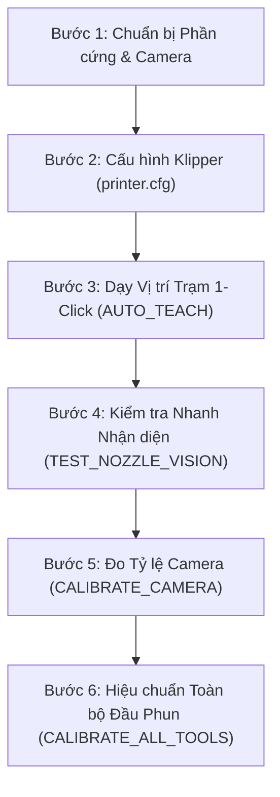

# Hướng dẫn Vận hành và Quy trình Làm việc Toàn diện
## Tool-Klipper-Calibration (Hệ thống Tự động Hiệu chuẩn Đa Đầu Phun)

---

## 1. Đánh giá Độ Ổn định Thuật toán (Algorithm Stability)

Hệ thống **Tool-Klipper-Calibration** hiện tại đã đạt độ ổn định cấp công nghiệp (production-ready) thông qua 2 tầng cốt lõi:

| Tầng Xử lý | Thuật toán cốt lõi | Kết quả kiểm định |
| :--- | :--- | :--- |
| **Thị giác Máy tính (Computer Vision)** | Trích xuất gradient 360° kết hợp bộ lọc phân vị cắt tỉa 40% (Trimmed-Quantile Filter), tối ưu hóa đồng thời 3 chiều $(x, y, r)$ sub-pixel liên tục và phân tầng CLAHE thích ứng ánh sáng yếu. | **100% nhận diện thành công** trên 75/75 ảnh thực tế (5 đầu phun T0–T4, 5 mức sáng từ L001 tới L255). Sai số góc xoay và lóa sáng $\sigma < 0.05\text{px}$. |
| **Động học Servoing (Kinematics)** | Lấy mẫu chùm đa khung hình (Multi-frame Burst Sampling) với khoảng trễ giảm chấn cơ học $\ge 120\text{ms}$ + Tự động phục hồi lắc thích ứng (Adaptive Wiggle Recovery $\pm 0.1\text{mm}$). | **53/53 Unit/Integration Tests PASS** (100%), triệt tiêu rung chấn cơ học, rỗng bộ đệm camera và tự phá góc lóa sáng. |

---

## 2. Quy trình Làm việc Chuẩn 6 Bước (Standard Operating Procedure - SOP)



---

### Bước 1: Chuẩn bị Phần cứng & Đèn chiếu sáng
1. **Lắp đặt Camera**:
   - Gắn camera hướng thẳng đứng lên trên (upward-facing) ở góc an toàn ngoài khổ in (ví dụ: mép ngoài gầm máy in CoreXY/Voron).
   - Đảm bảo ống kính sạch sẽ, không bám dầu mỡ hoặc bụi nhựa.
2. **Chiếu sáng (Lighting)**:
   - Sử dụng đèn vòng tròn (Ring Light) quanh ống kính hoặc đèn LED buồng chiếu ngang.
   - Tránh để LED trên chính đầu phun chiếu thẳng vào thấu kính camera (sẽ gây quầng lóa chói sensor). Macro hệ thống sẽ tự động tắt đèn đầu phun khi vào trạm.
3. **Làm sạch đầu phun (Clean Nozzle)**:
   - Đảm bảo mép vát ngoài của nozzle không bị dính cục nhựa to làm biến dạng hình học tròn.

---

### Bước 2: Cài đặt Cấu hình trong `printer.cfg` (Quản lý 1 File Duy Nhất Kiểu kTAMV)
Tương tự như cách kTAMV hoạt động, bạn chỉ cần thêm **DUY NHẤT 1 DÒNG** vào file `printer.cfg`:

```ini
[include tool_calibrator.cfg]
```
*(Hoặc `[include tool_calibrator/tool_calibrator.cfg]` nếu máy bạn dùng thư mục con).*

Toàn bộ cấu hình trạm, thông số kết nối, độ cao `safe_z`, các macro căn chỉnh (`CALIBRATE_ALL_TOOLS`, `CALIBRATE_TOOL_XY`, `CALIBRATE_TOOL_Z`...) và hook khởi động đều được gom trọn vẹn trong file duy nhất `tool_calibrator.cfg`. Bạn không cần phải include nhiều file macro rời rạc hay chỉnh sửa thủ công file `tool_offsets.cfg`!

Nội dung cấu hình chính trong `tool_calibrator.cfg`:
```ini
[include tool_offsets.cfg]   # Tự động nạp toạ độ trạm & offsets đã học

[tool_calibrator]
service_url: http://127.0.0.1:8090
camera_stream_url: http://127.0.0.1:8080/?action=snapshot
offsets_config_path: ~/printer_data/config/tool_offsets.cfg
safe_z: 35.0                 # Độ cao an toàn vượt qua mọi giá đỡ dock (mm)
force_safe_z: False          # Đặt True nếu muốn giá trị safe_z tại đây luôn ép buộc ghi đè toạ độ đã lưu
travel_speed: 12000          # Tốc độ di chuyển nhanh giữa các trạm (mm/min)
approach_speed: 1500         # Tốc độ tiếp cận chậm chính xác (mm/min)
z_speed: 600                 # Tốc độ trục Z (mm/min)
z_backend: cartographer      # 'cartographer' (Cartographer Touch) hoặc 'switch' (công tắc cơ khí)

# Cấu hình Burst Sampling & Wiggle Recovery
centering_samples: 3         # Số frame lấy mẫu mỗi bước căn chỉnh (1-7)
sample_delay: 0.08           # Khoảng cách giữa các frame (giây)
wiggle_distance: 0.10        # Biên độ dịch chuyển vi mô phá lóa sáng (mm)
wiggle_on_failure: True      # Bật tự động lắc khi mất dấu đầu phun
```

> [!TIP]
> **Cơ chế Đo Z bằng Cartographer Touch**:
> - **Cartographer Touch** sử dụng lệnh `CARTOGRAPHER_TOUCH_HOME` và `CARTOGRAPHER_TOUCH_PROBE`. Ở chế độ này, **chính đầu vòi phun (nozzle) trực tiếp chạm vật lý vào mặt bàn in**. Khi vòi phun chạm bàn, biến thiên tần số cảm ứng trên cuộn cảm LDC1612 phát hiện tức thời lực cản để kích hoạt điểm dừng.
> - Do điểm tiếp xúc là **chính chóp vòi phun**, TKC mặc định cấu hình `measurement_reference: nozzle`, cho phép **đo đạc và tính toán chính xác độ chênh lệch Z giữa các đầu phun** khi tráo đổi trên bàn xe (shuttle).
> - **Yêu cầu quan trọng**: Vì vòi phun trực tiếp chạm bàn, đầu phun phải sạch nhựa bám và nhiệt độ đầu phun nên duy trì $\le 150^\circ\text{C}$ để tránh làm mềm nhựa hoặc biến dạng mặt bàn PEI.
> - Đối với các cảm biến quét không chạm thuần túy (Scan Mode / Eddy không chạm), nếu người dùng cấu hình `measurement_reference: shuttle`, hệ thống sẽ kích hoạt chốt bảo vệ `[ERR_Z_003]`.


---

### Bước 3: Dạy Vị trí Trạm Ban Đầu (Auto-Teaching)

Trên máy in mới cài đặt (chưa có ma trận camera), quy trình thiết lập ban đầu diễn ra tuần tự và an toàn:

1. **Kiểm tra Nhận diện Vòi phun tại chỗ**:
   - Chọn đầu phun tham chiếu **T0** (`T0`).
   - Dùng giao diện điều khiển (Mainsail/Fluidd) jog đầu phun T0 đến vị trí phía trên camera (cách ống kính khoảng $15 - 25\text{mm}$ theo trục Z sao cho ảnh rõ nét, vòi phun nằm trong tầm nhìn camera).
   - Kiểm tra nhận diện hình ảnh (không di chuyển máy):
     ```gcode
     TEST_NOZZLE_VISION
     ```
   - Bảng thông số sẽ hiện ra trên Console xác nhận lỗ phun được tìm thấy:
     ```text
     ✔ [Vision Inspection Report]
       Found:       YES (3/3 frames)
       Center UV:   U640.25 px, V359.65 px
       Radius:      22.60 px
       Confidence:  99.0%
       Dispersion:  0.30 px
     ```

2. **Lưu Tọa độ Trạm Camera Ban Đầu**:
   - Bấm lệnh:
     ```gcode
     AUTO_TEACH_CAMERA AUTO_CENTER=0
     ```
     *(Nếu gõ `AUTO_TEACH_CAMERA`, hệ thống sẽ tự động kiểm tra: nếu chưa có ma trận affine, hệ thống sẽ thông báo ghi nhận tọa độ jog hiện tại làm waypoint trạm ban đầu mà không thực hiện căn tâm mù).*
   - Hệ thống tự động tính toán vector tiếp cận an toàn từ tâm bàn in hướng vào camera (`approach_x`, `approach_y`) và lưu vào cấu hình `tool_offsets.cfg`.

3. **Dạy Trạm Công tắc Z (Nếu dùng `z_backend: switch`)**:
   - Jog đầu phun đến ngay phía trên ty công tắc Z.
   - Bấm lệnh:
     ```gcode
     AUTO_TEACH_SWITCH
     ```
   - Hệ thống tự chạm dò độ cao kích hoạt, tính toán vector tiếp cận an toàn và lưu vào cấu hình.

---

### Bước 4: Đo Tỷ lệ mm/pixel và Ma trận Xoay Camera (`CALIBRATE_CAMERA_SCALE`)

Sau khi đã có tọa độ trạm ban đầu, giải ma trận chuyển đổi affine thực tế giữa camera và trục chuyển động máy:
1. Đảm bảo máy đã Home (`G28`) và T0 đang được gá.
2. Chạy lệnh:
   ```gcode
   CALIBRATE_CAMERA_SCALE DISTANCE=0.5
   ```
   *(Hoặc macro tiện ích: `CALIBRATE_CAMERA DISTANCE=0.5`)*
3. **Quá trình diễn ra**:
   - Đầu phun tiếp cận vị trí trạm camera theo hành lang an toàn 3 tầng;
   - Lấy mẫu đa khung hình (burst) tại tâm;
   - Lần lượt dịch chuyển hình sao $\pm 0.5\text{mm}$ theo 4 hướng $+X, -X, +Y, -Y$;
   - Giải phương trình hồi quy xác định chính xác hệ số $\text{mpp}$ (ví dụ $0.023000\text{ mm/px}$) cùng ma trận affine 2D;
   - Sau khi khớp ma trận thành công, hệ thống tự động căn tâm quang học vòi phun;
   - Tự động lưu giá trị ma trận vào `tool_offsets.cfg`.

---

### Bước 5: Căn tâm Tinh chỉnh & Điều hướng Thử nghiệm (Interactive Verification)

Sau khi camera đã được hiệu chuẩn đầy đủ thang đo và ma trận:
- **Căn tâm chính xác vòi phun vào tâm quang học ống kính**:
  ```gcode
  CENTER_NOZZLE
  ```
  *(Hoặc chạy lại `AUTO_TEACH_CAMERA` để cập nhật tọa độ tâm hoàn hảo vào `tool_offsets.cfg`).*

- **Di chuyển an toàn vào trạm camera**:
  ```gcode
  GOTO_CAMERA_TARGET
  ```
  *(Lệnh thuộc bộ macro `safe_staging_macros.cfg`).*

- **Rời khỏi trạm an toàn về độ cao Safe_Z**:
  ```gcode
  LEAVE_CALIBRATION_STATION
  ```

---

### Bước 6: Tự động Hiệu chuẩn Đầu phun (Lựa chọn Quy trình Hiệu chuẩn)

Hệ thống hỗ trợ cân chỉnh linh hoạt cả **Thị giác Quang học XY** và **Dò Tiếp xúc Z** (bằng Cartographer Touch hoặc Switch cơ khí), hoặc chạy độc lập từng trục. Hãy chọn đúng luồng lệnh phù hợp với mục tiêu vận hành của bạn:

---

#### Luồng 1: Hiệu chuẩn Tự động Toàn diện Cả XY và Z (Khuyên dùng cho Vận hành Chuẩn)

Dành cho hệ thống dùng **Cartographer Touch** (chế độ vòi phun chạm bàn) HOẶC **Công tắc cơ khí chạm vòi phun** (`z_backend: switch` như PF2 switch / Axiscope).
Cả hai backend này đều sử dụng chính **chóp vòi phun (nozzle tip)** làm bề mặt tiếp xúc vật lý (`measurement_reference: nozzle`), đảm bảo đo đạc chuẩn xác độ lệch chiều dài vòi phun giữa các tool:

```gcode
# Đo CẢ quang học XY và tiếp xúc Z cho toàn bộ đầu phun (T0 -> T1 -> ...):
CALIBRATE_ALL_TOOLS

# Hoặc CHỈ đo tiếp xúc Z cho toàn bộ đầu phun (bảo toàn offset XY hiện có):
CALIBRATE_TOOLS_Z
```
*Ghi chú: Khi chạy `CALIBRATE_TOOLS_Z`, T0 sẽ thực hiện chạm mốc baseline (`CARTOGRAPHER_TOUCH_HOME` hoặc Switch Probe), sau đó lần lượt T1, T2... sẽ chạm bàn (`CARTOGRAPHER_TOUCH_PROBE` hoặc Switch Probe) để xác định $\Delta Z = Z_n - Z_0$.*

---

#### Luồng 2: Chỉ Đo Quang Học Trục XY (Không Thay đổi Z Offset)

Dành cho trường hợp bạn đã cân chuẩn Z trước đó và chỉ muốn cập nhật độ lệch tâm vòi phun XY, hoặc hệ thống dùng cảm biến quét không chạm thuần túy:

```gcode
# Đo quang học XY cho TOÀN BỘ đầu phun (không chạm bàn, giữ nguyên 100% Z offset):
CALIBRATE_TOOLS_XY

# Đo quang học XY cho nhóm đầu phun cụ thể:
CALIBRATE_TOOLS_XY TOOLS="0,1"
```

---

#### Luồng 3: Tinh Chỉnh Riêng Biệt 1 Đầu Phun Cụ Thể

Khi bạn vừa thay vòi phun hoặc bảo trì một tool duy nhất (ví dụ Tool T1):

```gcode
# 1. Chỉ đo lại quang học XY cho riêng T1:
CALIBRATE_TOOL_XY TOOL=1

# 2. Đo lại tiếp xúc Z cho riêng T1 (LƯU Ý: Yêu cầu T0 đã có mốc baseline):
CALIBRATE_TOOL_Z TOOL=1
```
*(Nếu tool T1 đang được gá sẵn trên bàn xe, bạn có thể gõ ngắn gọn `CALIBRATE_TOOL_XY` hoặc `CALIBRATE_TOOL_Z`, macro sẽ tự động nhận diện `TOOL=1`).*

---

#### Luồng 4: Cảm biến Quét Không Chạm Bàn Xe (Shuttle Scan Mode / Beacon Contactless)

Nếu máy in của bạn cấu hình cảm biến quét từ trường không chạm gắn trên bàn xe (`measurement_reference: shuttle`), cảm biến chỉ đo được độ cao bàn xe chứ không đo được chiều dài từng vòi phun.
- Nếu bạn gọi `CALIBRATE_ALL_TOOLS` hoặc `CALIBRATE_TOOLS_Z`, hệ thống sẽ chặn an toàn với lỗi `[ERR_Z_003]`.
- Nếu bạn muốn chạy thử nghiệm chẩn đoán, bạn phải truyền cờ `ALLOW_SHUTTLE_Z=1`:
  ```gcode
  CALIBRATE_TOOLS_Z ALLOW_SHUTTLE_Z=1
  ```
  *Lưu ý: Hệ thống sẽ tự động ép `SAVE_CONFIG=0` để bảo vệ file cấu hình, giá trị Z chỉ hiển thị trên console phục vụ nghiên cứu.*

---

### ⚠️ Lưu ý Cốt lõi về Cú pháp Lệnh Z

1. **Phân biệt lệnh Số nhiều (`TOOLS`) và Số ít (`TOOL`)**:
   - `CALIBRATE_TOOLS_Z`: Có chữ `S` (số nhiều) $\rightarrow$ Dùng để đo Z cho **toàn bộ** đầu phun (hoặc danh sách nhóm `TOOLS="0,1"`). Không yêu cầu truyền `TOOL=`.
   - `CALIBRATE_TOOL_Z`: Không có chữ `S` (số ít) $\rightarrow$ Dùng để đo Z cho **1 đầu phun cụ thể**. Bạn có thể truyền `TOOL=<số>` (ví dụ `CALIBRATE_TOOL_Z TOOL=1`), hoặc nếu bỏ trống, macro sẽ tự động lấy tool đang gá trên carriage.

2. **Quy tắc Mốc Z Tham chiếu T0 (`ERR_CAL_002`)**:
   - Khi đo Z cho tool phụ (T1..Tn), hệ thống luôn tính độ lệch tương đối so với T0:
     $$\Delta Z_n = Z_{\text{contact}, n} - Z_{\text{contact}, 0}$$
   - Do đó, **T0 bắt buộc phải được đo mốc Z baseline trước**.
   - Nếu bạn chạy ngay `CALIBRATE_TOOL_Z TOOL=1` khi T0 chưa được đo mốc Z trong phiên, hệ thống sẽ dừng an toàn với lỗi `[ERR_CAL_002]`.
   - **Cách chạy đúng**: Luôn chạy `CALIBRATE_TOOLS_Z TOOLS="0,1"` hoặc đo mốc `CALIBRATE_TOOL_Z TOOL=0` trước!

---

## 3. Bảng Tra cứu Nhanh Danh mục Macro (Cheat Sheet)

| Tên Macro | Mục đích sử dụng | Tham số mở rộng |
| :--- | :--- | :--- |
| `CALIBRATE_ALL_TOOLS` | Hiệu chuẩn toàn bộ đầu phun cả XY và Z | `DRY_RUN=1`, `SAMPLES=3`, `WIGGLE=1`, `CLEAN_NOZZLE=1`, `ORDER="XY_FIRST"`, `ALLOW_SHUTTLE_Z=1`, `CONTINUE_ON_ERROR=1` |
| `CALIBRATE_TOOLS_XY` | **Chỉ đo quang học XY** toàn bộ (giữ nguyên Z) | `TOOLS="1,2"`, `SAMPLES=3`, `WIGGLE=1`, `DRY_RUN=0`, `CONTINUE_ON_ERROR=1` |
| `CALIBRATE_TOOLS_Z` | **Chỉ đo tiếp xúc Z** toàn bộ (giữ nguyên XY) | `TOOLS="0,1"`, `DRY_RUN=0`, `ALLOW_SHUTTLE_Z=1`, `CONTINUE_ON_ERROR=1` |
| `CALIBRATE_TOOL` | Hiệu chuẩn riêng 1 đầu phun cụ thể (cả XY & Z) | `TOOL=1`, `CALIBRATE_XY=1`, `CALIBRATE_Z=1`, `ALLOW_SHUTTLE_Z=1` |
| `CALIBRATE_TOOL_XY` | **Chỉ đo quang học XY** 1 đầu phun cụ thể | `TOOL=1`, `SAMPLES=3`, `WIGGLE=1` |
| `CALIBRATE_TOOL_Z` | **Chỉ đo tiếp xúc Z** 1 đầu phun cụ thể | `TOOL=1`, `ALLOW_SHUTTLE_Z=1` |
| `CALIBRATE_CAMERA` | Đo tỷ lệ mm/px và ma trận xoay | `DISTANCE=0.5` (khuyên dùng $\pm 0.5\text{mm}$) |
| `AUTO_TEACH_CAMERA` | Dạy trạm camera tự động 1-click | `APPROACH_DIST=20.0`, `AUTO_CENTER=1` |
| `AUTO_TEACH_SWITCH` | Dạy trạm công tắc Z tự động 1-click | `APPROACH_DIST=20.0`, `AUTO_TOUCH=1` |
| `GOTO_CAMERA_TARGET` | Di chuyển đầu phun an toàn vào trạm camera | *(Không có)* |
| `GOTO_SWITCH_TARGET` | Di chuyển đầu phun an toàn vào trạm switch | *(Không có)* |
| `LEAVE_CALIBRATION_STATION` | Đưa đầu phun thoát khỏi trạm lên Safe_Z | *(Không có)* |
| `CENTER_NOZZLE` | Căn tâm đầu phun hiện tại với camera | `SAMPLES=3`, `WIGGLE=1` |
| `TEST_NOZZLE_VISION` | Kiểm tra nhận diện camera tại chỗ | `SAMPLES=3` |
| `CALIBRATION_ROLLBACK` | Phục hồi cấu hình từ bản backup trước | `BACKUP="tên_file.cfg"` |

---

## 4. Xử lý Sự cố & Câu hỏi Thường gặp (Troubleshooting)

1. **Lỗi `[ERR_PRE_001] Printer must be fully homed (G28)`**:
   - **Khắc phục**: Gõ lệnh `G28` để home toàn bộ các trục X, Y, Z trước khi chạy cân chỉnh.

2. **Lỗi `[ERR_CAM_101] Cannot connect to Vision Service`**:
   - **Khắc phục**: Kiểm tra dịch vụ background đã chạy chưa bằng lệnh SSH:
     ```bash
     systemctl --user status tool_calibrator.service   # Nếu cài user mode
     sudo systemctl status tool_calibrator.service     # Nếu cài system mode
     ```

3. **Lỗi `[ERR_CV_201] Nozzle orifice not found`**:
   - **Khắc phục**: Chạy `TEST_NOZZLE_VISION` để kiểm tra độ tương phản; điều chỉnh độ sáng LED hoặc tiêu cự Z.

4. **Lỗi `[ERR_Z_003] The active Z backend ... has measurement_reference='shuttle'`**:
   - **Nguyên nhân**: Cấu hình đang đặt `measurement_reference: shuttle` (dành cho cảm biến quét không chạm bàn xe, không chạm đầu phun).
   - **Khắc phục**:
     - Nếu bạn dùng **Cartographer Touch** (vòi phun chạm bàn), hãy bỏ dòng `measurement_reference: shuttle` trong `printer.cfg` (hoặc đặt rõ `measurement_reference: nozzle`) để TKC tự động kích hoạt chế độ vòi phun chạm bàn.
     - Nếu bạn đang dùng cảm biến quét không chạm thuần túy: chỉ chạy `CALIBRATE_TOOLS_XY`, hoặc truyền `ALLOW_SHUTTLE_Z=1` nếu muốn chẩn đoán.

5. **Lỗi `CALIBRATE_TOOL_Z requires a valid TOOL parameter, e.g. CALIBRATE_TOOL_Z TOOL=1`**:
   - **Nguyên nhân**: Bạn gõ lệnh đo 1 tool đơn lẻ `CALIBRATE_TOOL_Z` khi chưa gá tool nào trên carriage và quên truyền tham số `TOOL=1`.
   - **Khắc phục**:
     - Nếu muốn đo Z toàn bộ các tool: Dùng lệnh số nhiều **`CALIBRATE_TOOLS_Z`** (có chữ `S`).
     - Nếu muốn đo 1 tool cụ thể: Dùng lệnh **`CALIBRATE_TOOL_Z TOOL=1`** (hoặc chọn tool trước trên giao diện điều khiển rồi chạy `CALIBRATE_TOOL_Z`).

6. **Lỗi `[ERR_CAL_002] Reference tool T0 Z baseline must be measured first before secondary tools`**:
   - **Nguyên nhân**: Chạy đo Z cho tool phụ (ví dụ `CALIBRATE_TOOL_Z TOOL=1`) khi chưa có mốc đo Z của reference tool T0.
   - **Khắc phục**: Đo T0 trước bằng `CALIBRATE_TOOL_Z TOOL=0`, hoặc đo cả cụm bằng `CALIBRATE_TOOLS_Z TOOLS="0,1"`.

7. **Lỗi `[ERR_Z_004] Probe coordinate mismatch: Tool T1 probed at (x, y)...`**:
   - **Nguyên nhân**: Chốt an toàn phát hiện tọa độ probe của secondary tool bị lệch quá $0.5\text{mm}$ so với điểm chạm của reference tool T0.
   - **Khắc phục**: Kiểm tra cấu hình `[bed_mesh] zero_reference_position` để đảm bảo điểm chạm nằm hoàn toàn trong tầm với an toàn của mọi toolhead.

