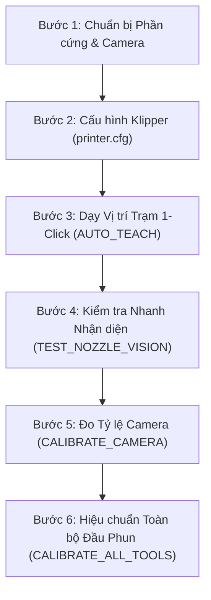

# Hướng dẫn Vận hành và Quy trình Làm việc Toàn diện
## Tool-Klipper-Calibration (Hệ thống Tự động Hiệu chuẩn Đa Đầu Phun)

---

## 1. Đánh giá Độ Ổn định Thuật toán (Algorithm Stability)

Hệ thống **Tool-Klipper-Calibration** hiện tại đã đạt độ ổn định cấp công nghiệp (production-ready) thông qua 2 tầng cốt lõi:

| Tầng Xử lý | Thuật toán cốt lõi | Kết quả kiểm định |
| :--- | :--- | :--- |
| **Thị giác Máy tính (Computer Vision)** | Trích xuất gradient 360° kết hợp bộ lọc phân vị cắt tỉa 40% (Trimmed-Quantile Filter), tối ưu hóa đồng thời 3 chiều $(x, y, r)$ sub-pixel liên tục và phân tầng CLAHE thích ứng ánh sáng yếu. | **100% nhận diện thành công** trên 75/75 ảnh thực tế (5 đầu phun T0–T4, 5 mức sáng từ L001 tới L255). Sai số góc xoay và lóa sáng $\sigma < 0.05\text{px}$. |
| **Động học Servoing (Kinematics)** | Lấy mẫu chùm đa khung hình (Multi-frame Burst Sampling) với khoảng trễ giảm chấn cơ học $\ge 120\text{ms}$ + Tự động phục hồi lắc thích ứng (Adaptive Wiggle Recovery $\pm 0.1\text{mm}$). | **53/53 Unit/Integration Tests PASS** (100%), triệt tiêu rung chấn cơ học, rỗng bộ đệm camera và tự phá góc lóa sáng. |

---

## 2. Quy trình Làm việc Chuẩn 6 Bước (Standard Operating Procedure - SOP)



---

### Bước 1: Chuẩn bị Phần cứng & Đèn chiếu sáng
1. **Lắp đặt Camera**:
   - Gắn camera hướng thẳng đứng lên trên (upward-facing) ở góc an toàn ngoài khổ in (ví dụ: mép ngoài gầm máy in CoreXY/Voron).
   - Đảm bảo ống kính sạch sẽ, không bám dầu mỡ hoặc bụi nhựa.
2. **Chiếu sáng (Lighting)**:
   - Sử dụng đèn vòng tròn (Ring Light) quanh ống kính hoặc đèn LED buồng chiếu ngang.
   - Tránh để LED trên chính đầu phun chiếu thẳng vào thấu kính camera (sẽ gây quầng lóa chói sensor). Macro hệ thống sẽ tự động tắt đèn đầu phun khi vào trạm.
3. **Làm sạch đầu phun (Clean Nozzle)**:
   - Đảm bảo mép vát ngoài của nozzle không bị dính cục nhựa to làm biến dạng hình học tròn.

---

### Bước 2: Cài đặt Cấu hình trong `printer.cfg`
Thêm các dòng include sau vào file `printer.cfg`:

```ini
[include macros/tool_calibrator_macros.cfg]
[include macros/safe_staging_macros.cfg]
[include ~/printer_data/config/tool_offsets.cfg]

[tool_calibrator]
service_url: http://127.0.0.1:8090
camera_stream_url: http://127.0.0.1:8080/?action=snapshot
offsets_config_path: ~/printer_data/config/tool_offsets.cfg
safe_z: 35.0                 # Độ cao an toàn vượt qua mọi giá đỡ dock (mm)
travel_speed: 12000          # Tốc độ di chuyển nhanh giữa các trạm (mm/min)
approach_speed: 1500         # Tốc độ tiếp cận chậm chính xác (mm/min)
z_speed: 600                 # Tốc độ trục Z (mm/min)
z_backend: cartographer      # 'cartographer' (shuttle probe) hoặc 'switch' (công tắc tiếp xúc nozzle)

# Cấu hình Burst Sampling & Wiggle Recovery
centering_samples: 3         # Số frame lấy mẫu mỗi bước căn chỉnh (1-7)
sample_delay: 0.08           # Khoảng cách giữa các frame (giây)
wiggle_distance: 0.10        # Biên độ dịch chuyển vi mô phá lóa sáng (mm)
wiggle_on_failure: True      # Bật tự động lắc khi mất dấu đầu phun
```

> [!IMPORTANT]
> **Lưu ý Quan trọng về `z_backend: cartographer` vs `z_backend: switch`**:
> - **Cartographer / Eddy / Beacon (Shuttle Probe)**: Cảm biến gắn cố định trên carriage/shuttle. Khi thay đổi đầu phun (T0 $\rightarrow$ T1 $\rightarrow$ T2), khoảng cách từ đầu dò Cartographer tới bàn in **hoàn toàn không thay đổi theo chiều dài vòi phun (nozzle tip length)**. Do đó, probe shuttle **không thể** tự động đo được Z offset giữa các đầu phun khác nhau! Để bảo vệ bàn in và tránh làm hỏng cấu hình, TKC mặc định kích hoạt chốt an toàn **`[ERR_Z_003]`** từ chối cân Z trên probe kiểu shuttle.
> - **Quy trình chuẩn cho máy dùng Cartographer**: Dùng TKC để **tự động cân chỉnh quang học trục XY (`CALIBRATE_TOOLS_XY`)**, còn Z offset nên cân bằng công tắc cơ khí chạm đầu phun (`z_backend: switch` như PF2 switch / Axiscope) hoặc căn Z thủ công.
> - **Thử nghiệm chẩn đoán**: Nếu bạn muốn chạy thử nghiệm Cartographer Z cho mục đích chẩn đoán, bắt buộc phải truyền cờ `ALLOW_SHUTTLE_Z=1` (khi đó hệ thống sẽ tự động ép `SAVE_CONFIG=0` để bảo vệ file cấu hình).


---

### Bước 3: Dạy Vị trí Trạm Ban Đầu (Auto-Teaching)

Trên máy in mới cài đặt (chưa có ma trận camera), quy trình thiết lập ban đầu diễn ra tuần tự và an toàn:

1. **Kiểm tra Nhận diện Vòi phun tại chỗ**:
   - Chọn đầu phun tham chiếu **T0** (`T0`).
   - Dùng giao diện điều khiển (Mainsail/Fluidd) jog đầu phun T0 đến vị trí phía trên camera (cách ống kính khoảng $15 - 25\text{mm}$ theo trục Z sao cho ảnh rõ nét, vòi phun nằm trong tầm nhìn camera).
   - Kiểm tra nhận diện hình ảnh (không di chuyển máy):
     ```gcode
     TEST_NOZZLE_VISION
     ```
   - Bảng thông số sẽ hiện ra trên Console xác nhận lỗ phun được tìm thấy:
     ```text
     ✔ [Vision Inspection Report]
       Found:       YES (3/3 frames)
       Center UV:   U640.25 px, V359.65 px
       Radius:      22.60 px
       Confidence:  99.0%
       Dispersion:  0.30 px
     ```

2. **Lưu Tọa độ Trạm Camera Ban Đầu**:
   - Bấm lệnh:
     ```gcode
     AUTO_TEACH_CAMERA AUTO_CENTER=0
     ```
     *(Nếu gõ `AUTO_TEACH_CAMERA`, hệ thống sẽ tự động kiểm tra: nếu chưa có ma trận affine, hệ thống sẽ thông báo ghi nhận tọa độ jog hiện tại làm waypoint trạm ban đầu mà không thực hiện căn tâm mù).*
   - Hệ thống tự động tính toán vector tiếp cận an toàn từ tâm bàn in hướng vào camera (`approach_x`, `approach_y`) và lưu vào cấu hình `tool_offsets.cfg`.

3. **Dạy Trạm Công tắc Z (Nếu dùng `z_backend: switch`)**:
   - Jog đầu phun đến ngay phía trên ty công tắc Z.
   - Bấm lệnh:
     ```gcode
     AUTO_TEACH_SWITCH
     ```
   - Hệ thống tự chạm dò độ cao kích hoạt, tính toán vector tiếp cận an toàn và lưu vào cấu hình.

---

### Bước 4: Đo Tỷ lệ mm/pixel và Ma trận Xoay Camera (`CALIBRATE_CAMERA_SCALE`)

Sau khi đã có tọa độ trạm ban đầu, giải ma trận chuyển đổi affine thực tế giữa camera và trục chuyển động máy:
1. Đảm bảo máy đã Home (`G28`) và T0 đang được gá.
2. Chạy lệnh:
   ```gcode
   CALIBRATE_CAMERA_SCALE DISTANCE=0.5
   ```
   *(Hoặc macro tiện ích: `CALIBRATE_CAMERA DISTANCE=0.5`)*
3. **Quá trình diễn ra**:
   - Đầu phun tiếp cận vị trí trạm camera theo hành lang an toàn 3 tầng;
   - Lấy mẫu đa khung hình (burst) tại tâm;
   - Lần lượt dịch chuyển hình sao $\pm 0.5\text{mm}$ theo 4 hướng $+X, -X, +Y, -Y$;
   - Giải phương trình hồi quy xác định chính xác hệ số $\text{mpp}$ (ví dụ $0.023000\text{ mm/px}$) cùng ma trận affine 2D;
   - Sau khi khớp ma trận thành công, hệ thống tự động căn tâm quang học vòi phun;
   - Tự động lưu giá trị ma trận vào `tool_offsets.cfg`.

---

### Bước 5: Căn tâm Tinh chỉnh & Điều hướng Thử nghiệm (Interactive Verification)

Sau khi camera đã được hiệu chuẩn đầy đủ thang đo và ma trận:
- **Căn tâm chính xác vòi phun vào tâm quang học ống kính**:
  ```gcode
  CENTER_NOZZLE
  ```
  *(Hoặc chạy lại `AUTO_TEACH_CAMERA` để cập nhật tọa độ tâm hoàn hảo vào `tool_offsets.cfg`).*

- **Di chuyển an toàn vào trạm camera**:
  ```gcode
  GOTO_CAMERA_TARGET
  ```
  *(Lệnh thuộc bộ macro `safe_staging_macros.cfg`).*

- **Rời khỏi trạm an toàn về độ cao Safe_Z**:
  ```gcode
  LEAVE_CALIBRATION_STATION
  ```

---

### Bước 6: Tự động Hiệu chuẩn Đầu phun (Tách biệt Hoàn toàn XY và Z)

Hệ thống hỗ trợ **tách biệt độc lập 100% giữa đo quang học XY và dò tiếp xúc Z**. Hãy chọn đúng luồng lệnh phù hợp với cấu hình phần cứng của bạn:

---

#### Luồng 1: Máy dùng Cartographer / Eddy / Beacon (Khuyên dùng: Chỉ đo Quang học XY)

Đối với máy in dùng cảm biến gắn cố định trên bàn xe (shuttle probe) như Cartographer, cảm biến **chỉ đo độ cao bàn xe, không đo được chiều dài riêng biệt của từng vòi phun**. Do đó, quy trình chuẩn là sử dụng TKC để cân chỉnh quang học trục XY:

```gcode
# Đo quang học XY cho TOÀN BỘ đầu phun (không chạm bàn, giữ nguyên Z offset)
CALIBRATE_TOOLS_XY

# Đo quang học XY cho RIÊNG 1 đầu phun cụ thể (ví dụ T1)
CALIBRATE_TOOL_XY TOOL=1
```
*Lưu ý: Khi chỉ chạy đo XY, file `tool_offsets.cfg` chỉ cập nhật `gcode_x_offset` và `gcode_y_offset`. Giá trị `gcode_z_offset` của mọi đầu phun được giữ nguyên 100%, không bị ghi đè hay reset về 0.000.*

---

#### Luồng 2: Máy dùng Công tắc Tiếp xúc Đầu phun (`z_backend: switch`)

Đối với máy in có công tắc cơ khí chạm đầu vòi phun (PF2 switch, Axiscope pin...):

```gcode
# Đo CẢ quang học XY và tiếp xúc Z cho toàn bộ đầu phun
CALIBRATE_ALL_TOOLS

# Hoặc CHỈ đo tiếp xúc Z cho toàn bộ đầu phun (bảo toàn XY hiện có)
CALIBRATE_TOOLS_Z

# Đo tiếp xúc Z cho riêng đầu phun T1
CALIBRATE_TOOL_Z TOOL=1
```

---

#### Luồng 3: Thử nghiệm Chẩn đoán Z với Cartographer (`ALLOW_SHUTTLE_Z=1`)

Nếu bạn đang tiến hành nghiên cứu, thử nghiệm chẩn đoán độ lặp lại cảm biến Cartographer khi chạm bàn, bạn phải truyền thêm cờ `ALLOW_SHUTTLE_Z=1`:

```gcode
# Thử nghiệm đo Z Cartographer trên toàn bộ đầu phun:
CALIBRATE_TOOLS_Z ALLOW_SHUTTLE_Z=1

# Hoặc thử nghiệm trên riêng đầu phun T1:
CALIBRATE_TOOL_Z TOOL=1 ALLOW_SHUTTLE_Z=1
```
> [!WARNING]
> Khi bật `ALLOW_SHUTTLE_Z=1`, TKC sẽ **tự động ép `SAVE_CONFIG=0`** để bảo vệ file cấu hình sản xuất của bạn. Các giá trị Z đo được sẽ được gắn nhãn `[EXPERIMENTAL - NOT SAVED]` và chỉ hiển thị trên console phục vụ chẩn đoán.

---

### ⚠️ Lưu ý Cốt lõi về Cú pháp Lệnh Z

1. **Phân biệt lệnh Số nhiều (`TOOLS`) và Số ít (`TOOL`)**:
   - `CALIBRATE_TOOLS_Z`: Có chữ `S` (số nhiều) $\rightarrow$ Dùng để đo Z cho **toàn bộ** đầu phun (hoặc danh sách nhóm `TOOLS="0,1"`). Không yêu cầu truyền `TOOL=`.
   - `CALIBRATE_TOOL_Z`: Không có chữ `S` (số ít) $\rightarrow$ Dùng để đo Z cho **1 đầu phun cụ thể**. Bắt buộc truyền tham số `TOOL=<số>` (ví dụ `CALIBRATE_TOOL_Z TOOL=1`). Nếu không truyền, hệ thống sẽ cố gắng lấy tool đang gá trên carriage, nếu chưa gá tool nào sẽ báo lỗi.

2. **Quy tắc Mốc Z Tham chiếu T0 (`ERR_CAL_002`)**:
   - Khi đo Z cho tool phụ (T1..Tn), hệ thống luôn tính độ lệch tương đối so với T0:
     $$\Delta Z_n = Z_{\text{contact}, n} - Z_{\text{contact}, 0}$$
   - Do đó, **T0 bắt buộc phải được đo mốc Z baseline trước**.
   - Nếu bạn chạy ngay `CALIBRATE_TOOL_Z TOOL=1` khi T0 chưa được đo mốc Z trong phiên, hệ thống sẽ dừng an toàn với lỗi `[ERR_CAL_002]`.
   - **Cách chạy đúng**: Luôn chạy `CALIBRATE_TOOLS_Z TOOLS="0,1"` hoặc đo mốc `CALIBRATE_TOOL_Z TOOL=0` trước!

---

## 3. Bảng Tra cứu Nhanh Danh mục Macro (Cheat Sheet)

| Tên Macro | Mục đích sử dụng | Tham số mở rộng |
| :--- | :--- | :--- |
| `CALIBRATE_ALL_TOOLS` | Hiệu chuẩn toàn bộ đầu phun cả XY và Z | `DRY_RUN=1`, `SAMPLES=3`, `WIGGLE=1`, `CLEAN_NOZZLE=1`, `ORDER="XY_FIRST"`, `ALLOW_SHUTTLE_Z=1`, `CONTINUE_ON_ERROR=1` |
| `CALIBRATE_TOOLS_XY` | **Chỉ đo quang học XY** toàn bộ (giữ nguyên Z) | `TOOLS="1,2"`, `SAMPLES=3`, `WIGGLE=1`, `DRY_RUN=0`, `CONTINUE_ON_ERROR=1` |
| `CALIBRATE_TOOLS_Z` | **Chỉ đo tiếp xúc Z** toàn bộ (giữ nguyên XY) | `TOOLS="0,1"`, `DRY_RUN=0`, `ALLOW_SHUTTLE_Z=1`, `CONTINUE_ON_ERROR=1` |
| `CALIBRATE_TOOL` | Hiệu chuẩn riêng 1 đầu phun cụ thể (cả XY & Z) | `TOOL=1`, `CALIBRATE_XY=1`, `CALIBRATE_Z=1`, `ALLOW_SHUTTLE_Z=1` |
| `CALIBRATE_TOOL_XY` | **Chỉ đo quang học XY** 1 đầu phun cụ thể | `TOOL=1`, `SAMPLES=3`, `WIGGLE=1` |
| `CALIBRATE_TOOL_Z` | **Chỉ đo tiếp xúc Z** 1 đầu phun cụ thể | `TOOL=1`, `ALLOW_SHUTTLE_Z=1` |
| `CALIBRATE_CAMERA` | Đo tỷ lệ mm/px và ma trận xoay | `DISTANCE=0.5` (khuyên dùng $\pm 0.5\text{mm}$) |
| `AUTO_TEACH_CAMERA` | Dạy trạm camera tự động 1-click | `APPROACH_DIST=20.0`, `AUTO_CENTER=1` |
| `AUTO_TEACH_SWITCH` | Dạy trạm công tắc Z tự động 1-click | `APPROACH_DIST=20.0`, `AUTO_TOUCH=1` |
| `GOTO_CAMERA_TARGET` | Di chuyển đầu phun an toàn vào trạm camera | *(Không có)* |
| `GOTO_SWITCH_TARGET` | Di chuyển đầu phun an toàn vào trạm switch | *(Không có)* |
| `LEAVE_CALIBRATION_STATION` | Đưa đầu phun thoát khỏi trạm lên Safe_Z | *(Không có)* |
| `CENTER_NOZZLE` | Căn tâm đầu phun hiện tại với camera | `SAMPLES=3`, `WIGGLE=1` |
| `TEST_NOZZLE_VISION` | Kiểm tra nhận diện camera tại chỗ | `SAMPLES=3` |
| `CALIBRATION_ROLLBACK` | Phục hồi cấu hình từ bản backup trước | `BACKUP="tên_file.cfg"` |

---

## 4. Xử lý Sự cố & Câu hỏi Thường gặp (Troubleshooting)

1. **Lỗi `[ERR_PRE_001] Printer must be fully homed (G28)`**:
   - **Khắc phục**: Gõ lệnh `G28` để home toàn bộ các trục X, Y, Z trước khi chạy cân chỉnh.

2. **Lỗi `[ERR_CAM_101] Cannot connect to Vision Service`**:
   - **Khắc phục**: Kiểm tra dịch vụ background đã chạy chưa bằng lệnh SSH:
     ```bash
     systemctl --user status tool_calibrator.service   # Nếu cài user mode
     sudo systemctl status tool_calibrator.service     # Nếu cài system mode
     ```

3. **Lỗi `[ERR_CV_201] Nozzle orifice not found`**:
   - **Khắc phục**: Chạy `TEST_NOZZLE_VISION` để kiểm tra độ tương phản; điều chỉnh độ sáng LED hoặc tiêu cự Z.

4. **Lỗi `[ERR_Z_003] The active Z backend 'cartographer' has measurement_reference='shuttle'`**:
   - **Nguyên nhân**: Bạn đang dùng Cartographer và chạy lệnh đo Z (`CALIBRATE_TOOLS_Z` hoặc `CALIBRATE_ALL_TOOLS`). Cartographer gắn trên carriage không thể đo chiều dài riêng của từng vòi phun nên TKC chặn an toàn.
   - **Khắc phục**:
     - Với Cartographer, hãy chạy lệnh chỉ cân chỉnh quang học XY:
       ```gcode
       CALIBRATE_TOOLS_XY
       ```
     - Nếu đang làm thí nghiệm chẩn đoán với Cartographer, truyền cờ override:
       ```gcode
       CALIBRATE_TOOLS_Z ALLOW_SHUTTLE_Z=1
       ```

5. **Lỗi `CALIBRATE_TOOL_Z requires a valid TOOL parameter, e.g. CALIBRATE_TOOL_Z TOOL=1`**:
   - **Nguyên nhân**: Bạn gõ lệnh đo 1 tool đơn lẻ `CALIBRATE_TOOL_Z` mà quên truyền tham số `TOOL=1` (hoặc carriage đang ở trạng thái unmounted chưa gá tool).
   - **Khắc phục**:
     - Nếu muốn đo Z toàn bộ các tool: Dùng lệnh số nhiều **`CALIBRATE_TOOLS_Z`** (có chữ `S`).
     - Nếu muốn đo 1 tool cụ thể: Dùng lệnh **`CALIBRATE_TOOL_Z TOOL=1`**.

6. **Lỗi `[ERR_CAL_002] Reference tool T0 Z baseline must be measured first before secondary tools`**:
   - **Nguyên nhân**: Chạy đo Z cho tool phụ (ví dụ `CALIBRATE_TOOL_Z TOOL=1`) khi chưa có mốc đo Z của reference tool T0.
   - **Khắc phục**: Đo T0 trước bằng `CALIBRATE_TOOL_Z TOOL=0`, hoặc đo cả cụm bằng `CALIBRATE_TOOLS_Z TOOLS="0,1"`.

7. **Lỗi `[ERR_Z_004] Probe coordinate mismatch: Tool T1 probed at (x, y)...`**:
   - **Nguyên nhân**: Chốt an toàn phát hiện tọa độ probe của secondary tool bị lệch quá $0.5\text{mm}$ so với điểm chạm của reference tool T0.
   - **Khắc phục**: Kiểm tra cấu hình `[bed_mesh] zero_reference_position` để đảm bảo điểm chạm nằm hoàn toàn trong tầm với an toàn của mọi toolhead.

