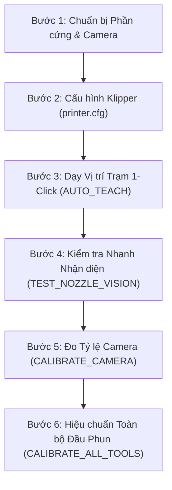

# Hướng dẫn Vận hành và Quy trình Làm việc Toàn diện
## Tool-Klipper-Calibration (Hệ thống Tự động Hiệu chuẩn Đa Đầu Phun)

---

## 1. Đánh giá Độ Ổn định Thuật toán (Algorithm Stability)

Hệ thống **Tool-Klipper-Calibration** hiện tại đã đạt độ ổn định cấp công nghiệp (production-ready) thông qua 2 tầng cốt lõi:

| Tầng Xử lý | Thuật toán cốt lõi | Kết quả kiểm định |
| :--- | :--- | :--- |
| **Thị giác Máy tính (Computer Vision)** | Trích xuất gradient 360° kết hợp bộ lọc phân vị cắt tỉa 40% (Trimmed-Quantile Filter), tối ưu hóa đồng thời 3 chiều $(x, y, r)$ sub-pixel liên tục và phân tầng CLAHE thích ứng ánh sáng yếu. | **100% nhận diện thành công** trên 75/75 ảnh thực tế (5 đầu phun T0–T4, 5 mức sáng từ L001 tới L255). Sai số góc xoay và lóa sáng $\sigma < 0.05\text{px}$. |
| **Động học Servoing (Kinematics)** | Lấy mẫu chùm đa khung hình (Multi-frame Burst Sampling) với khoảng trễ giảm chấn cơ học $\ge 120\text{ms}$ + Tự động phục hồi lắc thích ứng (Adaptive Wiggle Recovery $\pm 0.1\text{mm}$). | **53/53 Unit/Integration Tests PASS** (100%), triệt tiêu rung chấn cơ học, rỗng bộ đệm camera và tự phá góc lóa sáng. |

---

## 2. Quy trình Làm việc Chuẩn 6 Bước (Standard Operating Procedure - SOP)



---

### Bước 1: Chuẩn bị Phần cứng & Đèn chiếu sáng
1. **Lắp đặt Camera**:
   - Gắn camera hướng thẳng đứng lên trên (upward-facing) ở góc an toàn ngoài khổ in (ví dụ: mép ngoài gầm máy in CoreXY/Voron).
   - Đảm bảo ống kính sạch sẽ, không bám dầu mỡ hoặc bụi nhựa.
2. **Chiếu sáng (Lighting)**:
   - Sử dụng đèn vòng tròn (Ring Light) quanh ống kính hoặc đèn LED buồng chiếu ngang.
   - Tránh để LED trên chính đầu phun chiếu thẳng vào thấu kính camera (sẽ gây quầng lóa chói sensor). Macro hệ thống sẽ tự động tắt đèn đầu phun khi vào trạm.
3. **Làm sạch đầu phun (Clean Nozzle)**:
   - Đảm bảo mép vát ngoài của nozzle không bị dính cục nhựa to làm biến dạng hình học tròn.

---

### Bước 2: Cài đặt Cấu hình trong `printer.cfg`
Thêm các dòng include sau vào file `printer.cfg`:

```ini
[include macros/tool_calibrator_macros.cfg]
[include macros/safe_staging_macros.cfg]
[include ~/printer_data/config/tool_offsets.cfg]

[tool_calibrator]
service_url: http://127.0.0.1:8090
camera_stream_url: http://127.0.0.1:8080/?action=snapshot
offsets_config_path: ~/printer_data/config/tool_offsets.cfg
safe_z: 35.0                 # Độ cao an toàn vượt qua mọi giá đỡ dock (mm)
travel_speed: 12000          # Tốc độ di chuyển nhanh giữa các trạm (mm/min)
approach_speed: 1500         # Tốc độ tiếp cận chậm chính xác (mm/min)
z_speed: 600                 # Tốc độ trục Z (mm/min)
z_backend: cartographer      # Hoặc 'switch' nếu dùng công tắc cơ khí

# Cấu hình Burst Sampling & Wiggle Recovery
centering_samples: 3         # Số frame lấy mẫu mỗi bước căn chỉnh (1-7)
sample_delay: 0.08           # Khoảng cách giữa các frame (giây)
wiggle_distance: 0.10        # Biên độ dịch chuyển vi mô phá lóa sáng (mm)
wiggle_on_failure: True      # Bật tự động lắc khi mất dấu đầu phun
```

---

### Bước 3: Dạy Vị trí Trạm 1-Click (Auto-Teaching)

Bạn **không cần** phải đo đạc tọa độ thủ công bằng thước hay bấm máy tính:

1. **Dạy Trạm Camera**:
   - Chọn đầu phun tham chiếu **T0** (`T0`).
   - Dùng giao diện điều khiển (Mainsail/Fluidd) jog đầu phun T0 đến vị trí đại khái phía trên camera (cách ống kính khoảng $15 - 25\text{mm}$ theo trục Z sao cho ảnh rõ nét).
   - Bấm lệnh:
     ```gcode
     AUTO_TEACH_CAMERA
     ```
   - **Hệ thống tự động thực hiện**:
     - Bật đèn camera, tắt đèn đầu phun;
     - Dùng thuật toán thị giác căn chính xác tâm lỗ phun vào giữa camera;
     - Tự tính toán vector tiếp cận an toàn từ tâm bàn in hướng vào camera (`approach_x`, `approach_y`);
     - Tự động ghi và lưu vĩnh viễn vào file `tool_offsets.cfg`.

2. **Dạy Trạm Công tắc Z (Nếu dùng `z_backend: switch`)**:
   - Jog đầu phun đến ngay phía trên ty công tắc Z.
   - Bấm lệnh:
     ```gcode
     AUTO_TEACH_SWITCH
     ```
   - Hệ thống tự chạm dò độ cao kích hoạt, tính toán vector tiếp cận an toàn và lưu vào cấu hình.

---

### Bước 4: Kiểm tra Nhanh & Thử nghiệm Tương tác (Quick Inspection)

Trước khi chạy đo tự động toàn diện, bạn có thể tương tác nhanh với các macro hỗ trợ:

- **Đưa đầu phun vào vị trí kiểm tra**:
  ```gcode
  GOTO_CAMERA_TARGET
  ```
  *(Đầu phun nâng lên Safe_Z, di chuyển ngang ngoài trạm, hạ Z rồi lướt nhẹ vào vị trí camera).*

- **Kiểm tra độ nét và nhận diện lỗ phun tại chỗ (Không di chuyển)**:
  ```gcode
  TEST_NOZZLE_VISION
  ```
  *Bảng thông số sẽ hiện ra trên Console:*
  ```text
  ✔ [Vision Inspection Report]
    Found:       YES (3/3 frames)
    Center UV:   U320.15 px, V240.08 px
    Radius:      21.80 px
    Confidence:  98.5%
    Dispersion:  0.08 px
    Algorithm:   Tier 0 Curvature (Symmetric)
  ```

- **Thử nghiệm Căn tâm Servoing đơn lẻ**:
  ```gcode
  CENTER_NOZZLE
  ```

- **Đưa đầu phun rời trạm an toàn**:
  ```gcode
  LEAVE_CALIBRATION_STATION
  ```

---

### Bước 5: Đo Tỷ lệ mm/pixel và Ma trận Xoay Camera (`CALIBRATE_CAMERA`)

Để hệ thống chuyển đổi chính xác độ lệch điểm ảnh (pixel) sang dịch chuyển thực của máy in (mm):
1. Đảm bảo máy đã Home (`G28`) và T0 đang được chọn.
2. Chạy lệnh:
   ```gcode
   CALIBRATE_CAMERA DISTANCE=1.0
   ```
3. **Quá trình diễn ra**:
   - Đầu phun vào vị trí camera và tự căn tâm;
   - Lấy mẫu chùm (Burst) tại tâm;
   - Lần lượt dịch chuyển hình sao $\pm 1.0\text{mm}$ theo 4 hướng $+X, -X, +Y, -Y$;
   - Giải phương trình hồi quy tìm hệ số $\text{mpp}$ (ví dụ $0.01250\text{mm/px}$) và góc xoay của camera;
   - Tự động lưu giá trị vào `tool_offsets.cfg`.

---

### Bước 6: Tự động Hiệu chuẩn Đầu phun (Tách biệt Hoàn toàn XY và Z)

Hệ thống hỗ trợ **tách biệt độc lập 100% giữa đo quang học XY và dò tiếp xúc Z**. Điều này cực kỳ quan trọng đối với các máy in có phần cứng không đồng nhất:
- Máy chỉ có Camera hướng lên (chưa gắn switch Z hoặc dùng probe riêng);
- Bạn chỉ vừa thay nozzle hoặc chỉnh cơ khí trục X/Y mà không muốn làm mất offset Z đã căn chuẩn trước đó;
- Các đầu phun khác loại (khác chiều dài block, khác cảm biến đo độ cao Z);
- Bạn chỉ vừa thay đổi chiều dài nozzle và chỉ muốn chạy dò Z lại một đầu phun duy nhất mà giữ nguyên tọa độ XY.

#### A. Đo Cả XY và Z Đồng thời (Mặc định)
```gcode
# Đo toàn bộ đầu phun
CALIBRATE_ALL_TOOLS

# Đo riêng đầu phun T1
CALIBRATE_TOOL TOOL=1
```

#### B. Chỉ Đo Quang học XY (Bảo toàn nguyên vẹn Z Offset hiện có)
```gcode
# Đo XY cho toàn bộ đầu phun (không chạm Z, không cần probe Z)
CALIBRATE_TOOLS_XY

# Đo XY cho riêng đầu phun T1
CALIBRATE_TOOL_XY TOOL=1
```
*Lưu ý: Khi chỉ chạy đo XY, file `tool_offsets.cfg` chỉ cập nhật `gcode_x_offset` và `gcode_y_offset`. Giá trị `gcode_z_offset` của mọi đầu phun sẽ được giữ nguyên 100%, không bị ghi đè hay reset về 0.000.*

#### C. Chỉ Đo Tiếp xúc Z (Bảo toàn nguyên vẹn XY Offset hiện có)
```gcode
# Đo Z cho toàn bộ đầu phun (không cần bật camera hay vision service)
CALIBRATE_TOOLS_Z

# Đo Z cho riêng đầu phun T1
CALIBRATE_TOOL_Z TOOL=1
```
*Lưu ý: Khi chỉ chạy đo Z, file `tool_offsets.cfg` chỉ cập nhật `gcode_z_offset`. Toàn bộ tọa độ quang học `gcode_x_offset` và `gcode_y_offset` đã đo trước đó được bảo toàn tuyệt đối.*

---

## 3. Bảng Tra cứu Nhanh Danh mục Macro (Cheat Sheet)

| Tên Macro | Mục đích sử dụng | Tham số mở rộng |
| :--- | :--- | :--- |
| `CALIBRATE_ALL_TOOLS` | Hiệu chuẩn toàn bộ đầu phun cả XY và Z | `DRY_RUN=1`, `SAMPLES=3`, `WIGGLE=1`, `CLEAN_NOZZLE=1`, `ORDER="XY_FIRST"` |
| `CALIBRATE_TOOLS_XY` | **Chỉ đo quang học XY** toàn bộ (giữ nguyên Z) | `TOOLS="1,2"`, `SAMPLES=3`, `WIGGLE=1`, `DRY_RUN=0` |
| `CALIBRATE_TOOLS_Z` | **Chỉ đo tiếp xúc Z** toàn bộ (giữ nguyên XY) | `TOOLS="1,2"`, `DRY_RUN=0` |
| `CALIBRATE_TOOL` | Hiệu chuẩn riêng 1 đầu phun cụ thể (cả XY & Z) | `TOOL=1`, `CALIBRATE_XY=1`, `CALIBRATE_Z=1` |
| `CALIBRATE_TOOL_XY` | **Chỉ đo quang học XY** 1 đầu phun cụ thể | `TOOL=1`, `SAMPLES=3`, `WIGGLE=1` |
| `CALIBRATE_TOOL_Z` | **Chỉ đo tiếp xúc Z** 1 đầu phun cụ thể | `TOOL=1` |
| `CALIBRATE_CAMERA` | Đo tỷ lệ mm/px và ma trận xoay | `DISTANCE=1.0` (mặc định $\pm 1.0\text{mm}$) |
| `AUTO_TEACH_CAMERA` | Dạy trạm camera tự động 1-click | `APPROACH_DIST=25.0`, `AUTO_CENTER=1` |
| `AUTO_TEACH_SWITCH` | Dạy trạm công tắc Z tự động 1-click | `APPROACH_DIST=20.0`, `AUTO_TOUCH=1` |
| `GOTO_CAMERA_TARGET` | Di chuyển đầu phun an toàn vào trạm camera | *(Không có)* |
| `GOTO_SWITCH_TARGET` | Di chuyển đầu phun an toàn vào trạm switch | *(Không có)* |
| `LEAVE_CALIBRATION_STATION` | Đưa đầu phun thoát khỏi trạm lên Safe_Z | *(Không có)* |
| `CENTER_NOZZLE` | Căn tâm đầu phun hiện tại với camera | `SAMPLES=3`, `WIGGLE=1` |
| `TEST_NOZZLE_VISION` | Kiểm tra nhận diện camera tại chỗ | `SAMPLES=3` |
| `CALIBRATION_ROLLBACK` | Phục hồi cấu hình từ bản backup trước | `BACKUP="tên_file.cfg"` |

---

## 4. Xử lý Sự cố & Câu hỏi Thường gặp (Troubleshooting)

1. **Lỗi `[ERR_PRE_001] Printer must be fully homed (G28)`**:
   - **Khắc phục**: Gõ lệnh `G28` để home toàn bộ các trục X, Y, Z trước khi chạy cân chỉnh.

2. **Lỗi `[ERR_CAM_101] Cannot connect to Vision Service`**:
   - **Khắc phục**: Kiểm tra dịch vụ background đã chạy chưa bằng lệnh SSH:
     ```bash
     sudo systemctl status tool-calibrator-vision.service
     ```
   - Nếu chưa chạy, khởi động bằng:
     ```bash
     sudo systemctl start tool-calibrator-vision.service
     ```

3. **Lỗi `[ERR_CV_201] Nozzle orifice not found`**:
   - **Nguyên nhân**: Đầu phun quá mờ, camera mất nét, hoặc ánh sáng bị chói/quá tối.
   - **Khắc phục**:
     - Chạy `TEST_NOZZLE_VISION` để xem báo cáo;
     - Điều chỉnh độ cao tiêu cự Z (vặn chỉnh ốc ống kính hoặc chỉnh `camera_target_z`);
     - Điều chỉnh độ sáng đèn ring trong macro `_CALIBRATION_CAMERA_LED_ON` (ví dụ `VALUE=0.3` đến `0.6`).
     - Bật chế độ `WIGGLE=1` để đầu phun tự động lắc phá lóa sáng.

4. **Muốn khôi phục lại cấu hình trước đó**:
   - Gõ `CALIBRATION_ROLLBACK` trên console Klipper. Hệ thống sẽ khôi phục bản lưu gần nhất và yêu cầu `FIRMWARE_RESTART`.
