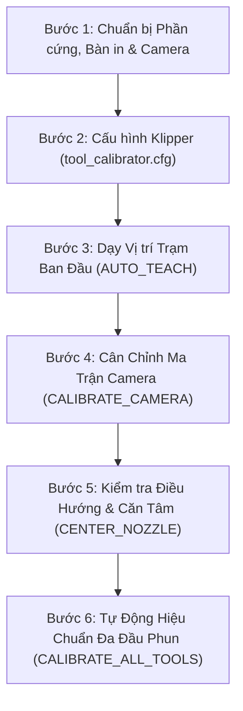

# HƯỚNG DẪN VẬN HÀNH VÀ QUY TRÌNH LÀM VIỆC TOÀN DIỆN
## Tool-Klipper-Calibration (Hệ Thống Tự Động Hiệu Chuẩn Đa Đầu Phun)

Tài liệu này hướng dẫn chi tiết quy trình vận hành thực tế chuẩn 6 bước, phân tích nguyên lý đo đạc của từng trục (Thị giác quang học XY & Dò tiếp xúc Z), danh mục lệnh macro đầy đủ và ma trận chẩn đoán lỗi cho **Tool-Klipper-Calibration (TKC)**.

---

## 1. Đánh Giá Độ Ổn Định Thuật Toán (Algorithm Stability)

Hệ thống **Tool-Klipper-Calibration** được thiết kế đạt tiêu chuẩn công nghiệp (production-ready) với khả năng chống nhiễu quang học và bảo vệ cơ khí 2 tầng:

| Tầng Xử Lý | Thuật Toán Cốt Lõi | Kết Quả Kiểm Định Thực Tế |
| :--- | :--- | :--- |
| **Thị giác Máy tính (Computer Vision)** | Trích xuất gradient 360° kết hợp bộ lọc phân vị cắt tỉa 40% (Trimmed-Quantile Filter), tối ưu hóa đồng thời 3 chiều $(x, y, r)$ sub-pixel liên tục và phân tầng CLAHE thích ứng ánh sáng yếu. | **100% nhận diện thành công** trên 75/75 ảnh thực tế (5 đầu phun T0–T4, 5 mức sáng từ L001 tới L255). Sai số lóa sáng $\sigma < 0.05\text{px}$. |
| **Động học Servoing (Kinematics)** | Lấy mẫu chùm đa khung hình (Burst Sampling) với khoảng trễ giảm rung cơ học $\ge 80\text{ms}$ + Tự động phục hồi lắc thích ứng vi mô (Adaptive Wiggle Recovery $\pm 0.1\text{mm}$). | **123/123 Unit/Integration Tests PASS** (100%), triệt tiêu rung chấn cơ học, loại bỏ frame rác và tự phá góc phản quang lóa sáng. |
| **Dò Tiếp xúc Z (Z Probing Backends)** | Hỗ trợ 2 cơ chế độc lập: **Cartographer Touch** (nozzle chạm trực tiếp bàn in) và **Công tắc cơ khí** (PF2 / Axiscope). Bảo vệ an toàn nhiệt độ bàn PEI ($\le 150^\circ\text{C}$). | Tự động kiểm tra toạ độ cùng điểm (tolerance $0.5\text{mm}$), chống sai số nghiêng bàn và tự tính $\Delta Z$ so sánh với mốc T0. |

---

## 2. Quy Trình Vận Hành Chuẩn 6 Bước (Standard Operating Procedure - SOP)



---

### Bước 1: Chuẩn bị Phần cứng & Camera
1. **Lắp đặt Camera quang học**:
   - Gắn camera hướng thẳng đứng lên trên (upward-facing) ở vị trí an toàn ngoài khổ in (ví dụ: góc trước hoặc mép ngoài gầm máy in CoreXY/Voron).
   - Đảm bảo ống kính camera sạch sẽ, không bám dầu mỡ hoặc bụi nhựa.
2. **Chiếu sáng (Lighting)**:
   - Sử dụng đèn vòng tròn (Ring Light) quanh ống kính camera hoặc đèn chiếu ngang buồng in.
   - **Lưu ý**: Tắt đèn chiếu thẳng từ đầu phun xuống camera để tránh quầng lóa sáng sensor. Macro hệ thống sẽ tự động tắt LED đầu phun khi đi vào trạm camera.
3. **Làm sạch vòi phun (Clean Nozzles)**:
   - Làm sạch toàn bộ các vòi phun (T0..Tn), đảm bảo mép vát lỗ phun không dính nhựa thừa làm méo hình tròn quang học.
   - Khi dùng **Cartographer Touch**, vòi phun phải sạch cặn nhựa ở chóp để tiếp xúc mặt bàn chính xác tuyệt đối.
4. **Nhiệt độ an toàn**:
   - Để vòi phun nguội dưới $150^\circ\text{C}$ (khuyên dùng nhiệt độ phòng hoặc $100-130^\circ\text{C}$ vừa đủ mềm nhựa mà không làm mềm lớp phủ PEI của bàn in).

---

### Bước 2: Cấu hình Klipper (`printer.cfg` & `tool_calibrator.cfg`)

#### 1. Khai báo nạp duy nhất trong `printer.cfg`:
Thêm đúng 1 dòng sau vào file `printer.cfg`:
```ini
[include tool_calibrator/tool_calibrator.cfg]
```
*(Nếu máy in sử dụng thư mục con như `Printer-Setup`, dòng khai báo là: `[include Printer-Setup/tool_calibrator/tool_calibrator.cfg]`)*.

#### 2. Tùy chỉnh thông số trong `tool_calibrator/tool_calibrator.cfg`:
Mở file `tool_calibrator/tool_calibrator.cfg` trực tiếp trên giao diện Mainsail / Fluidd (file có quyền ghi `chmod 664`, chỉnh sửa thoải mái):

```ini
[include tool_offsets.cfg]

[tool_calibrator]
service_url: http://127.0.0.1:8090
camera_stream_url: http://127.0.0.1:8080/?action=snapshot
offsets_config_path: ~/printer_data/config/tool_calibrator/tool_offsets.cfg

# safe_z: 35.0                 # Để comment (#) để kích hoạt Bứt Tốc Cartographer; bỏ comment để ép độ cao cụ thể
# force_safe_z: False          # Đặt True nếu muốn ép buộc dùng số safe_z này ghi đè trạm đã lưu

travel_speed: 12000          # Tốc độ di chuyển nhanh XY giữa các trạm (mm/min)
approach_speed: 1500         # Tốc độ tiếp cận chậm chính xác (mm/min)
z_speed: 600                 # Tốc độ trục Z (mm/min)

z_backend: cartographer      # 'cartographer' (Cartographer Touch) hoặc 'switch' (công tắc cơ khí)

centering_samples: 3         # Số frame lấy mẫu mỗi bước căn chỉnh (1-7)
sample_delay: 0.08           # Khoảng cách giữa các frame (giây)
wiggle_distance: 0.10        # Biên độ lắc vi mô phá lóa sáng (mm)
wiggle_on_failure: True      # Tự động lắc vi mô khi mất dấu đầu phun
max_camera_temp: 100.0       # Giới hạn nhiệt độ an toàn bảo vệ camera (°C) - FAIL-CLOSED nếu không đọc được nhiệt
```

> [!TIP]
> **Nguyên Lý Cartographer Touch (`measurement_reference: nozzle`):**
> - **Cartographer Touch** sử dụng lệnh `CARTOGRAPHER_TOUCH_HOME` và `CARTOGRAPHER_TOUCH_PROBE`. Ở chế độ này, **chính đầu vòi phun (nozzle tip) trực tiếp chạm vật lý vào mặt bàn in**. Khi vòi phun chạm bàn, cuộn cảm LDC1612 phát hiện tức thời sự biến thiên tần số cảm ứng để kích hoạt điểm dừng.
> - Do điểm tiếp xúc là **chính chóp vòi phun**, TKC mặc định cấu hình `measurement_reference: nozzle`, cho phép đo đạc và tính toán chính xác độ chênh lệch chiều dài Z giữa các đầu phun:
>   $$\Delta Z_n = Z_{\text{contact}, n} - Z_{\text{contact}, 0}$$
> - Nếu sử dụng cảm biến quét không chạm bàn xe thuần túy (Scan Mode không chạm), cấu hình `measurement_reference: shuttle` sẽ được TKC bảo vệ chặn lại qua mã lỗi `[ERR_Z_003]`.

> [!IMPORTANT]
> **Thiết Kế Safe Z 2 Tầng: Tách Biệt An Toàn Trạm & Bứt Tốc Đo Z Cartographer:**
> - **Khi để comment (`# safe_z`):** Bạn **không cần phải cấu hình phức tạp** `safe_z: 0.0` + `force_safe_z: True`. Chỉ cần để comment 2 dòng này, hệ thống sẽ tự động kích hoạt **Bứt Tốc** cho riêng chuỗi đo Z của Cartographer Touch (đầu phun chuyển tiếp đo các tool ở cao độ mặt bàn cực nhanh).
> - **Bảo vệ an toàn trạm & camera:** Tuy chuỗi đo Z chạy nhanh, nhưng hành trình vào/ra trạm Camera (`approach_camera`, `depart_station`) và trạm chuyển tool vẫn **luôn duy trì độ cao an toàn tách biệt** (độ cao trạm đã lưu hoặc mặc định 35.0mm, tối thiểu 10.0mm). Điều này loại bỏ hoàn toàn rủi ro va quệt camera khi bay ngang qua bàn in.
> - **Khi khai báo số cụ thể (`safe_z: 25.0`):** Toàn bộ chu trình sẽ tuân thủ nghiêm ngặt độ cao đã khai báo.
> - **Bảo vệ nhiệt độ Fail-Closed:** Trước khi đầu in tiến vào trạm camera, hệ thống tự động kiểm tra nhiệt độ của extruder tương ứng. Nếu nhiệt độ vượt ngưỡng hoặc không thể xác minh nhiệt độ (lỗi sensor), hệ thống lập tức dừng lại với mã `[ERR_PRE_002]` để bảo vệ camera/thấu kính.

---

### Bước 3: Dạy Vị trí Trạm Ban Đầu (Auto-Teaching)

Trên máy in mới thiết lập lần đầu (chưa có toạ độ trạm và ma trận camera):

1. **Kiểm tra Nhận diện Vòi phun tại chỗ**:
   - Chọn đầu phun tham chiếu **T0** (`T0`).
   - Dùng giao diện điều khiển (Mainsail/Fluidd) jog đầu phun T0 đến phía trên camera (cách thấu kính khoảng $15 - 25\text{mm}$ theo trục Z sao cho ảnh sắc nét, vòi phun nằm trong tầm nhìn camera).
   - Kiểm tra nhận diện hình ảnh tại chỗ (không di chuyển máy):
     ```gcode
     TEST_NOZZLE_VISION
     ```
   - Console sẽ hiển thị báo cáo chi tiết:
     ```text
     ✔ [Vision Inspection Report]
       Found:       YES (3/3 frames)
       Center UV:   U640.25 px, V359.65 px
       Radius:      22.60 px
       Confidence:  99.0%
       Dispersion:  0.30 px
     ```

2. **Lưu Tọa độ Trạm Camera Ban Đầu**:
   - Chạy lệnh tự động dạy trạm:
     ```gcode
     AUTO_TEACH_CAMERA AUTO_CENTER=0
     ```
   - Hệ thống tự động tính toán toạ độ tiếp cận an toàn (`cam_approach_x`, `cam_approach_y`) từ tâm bàn in hướng vào camera và lưu vào `tool_offsets.cfg`.

3. **Dạy Độ Cao Di Chuyển An Toàn (Safe_Z)**:
   - Jog đầu phun lên độ cao an toàn (vượt qua chiều cao của camera shroud và các dock gá tool, ví dụ Z=35mm).
   - Chạy lệnh:
     ```gcode
     TEACH_CAMERA_SAFE_Z
     ```
     *(Hoặc đặt rõ số: `TEACH_CAMERA_SAFE_Z Z=35`)*. Toạ độ Safe Z sẽ được tự động lưu vào `tool_offsets.cfg`.

4. **Dạy Trạm Công tắc Z (Chỉ áp dụng nếu dùng `z_backend: switch`)**:
   - Jog đầu phun T0 đến ngay phía trên ty công tắc Z.
   - Chạy lệnh:
     ```gcode
     AUTO_TEACH_SWITCH
     ```
   - Hệ thống sẽ tự động chạm dò độ cao kích hoạt, tính toán hành lang tiếp cận và lưu toạ độ vào `tool_offsets.cfg`.

---

### Bước 4: Cân Chỉnh Ma Trận Camera (`CALIBRATE_CAMERA`)

Sau khi đã có toạ độ trạm ban đầu, giải ma trận chuyển đổi affine 2D giữa toạ độ camera pixel và toạ độ mm của máy in:

1. Đảm bảo máy đã Home (`G28`) và T0 đang được gá trên carriage.
2. Chạy lệnh:
   ```gcode
   CALIBRATE_CAMERA DISTANCE=0.5
   ```
   *(Tham số `DISTANCE=0.5` cho độ dịch chuyển hình sao $\pm 0.5\text{mm}$ trong tầm nhìn camera)*.
3. **Quá trình diễn ra tự động**:
   - Đầu phun tiếp cận vị trí trạm camera an toàn;
   - Lấy mẫu hình ảnh tại tâm;
   - Lần lượt dịch chuyển $\pm 0.5\text{mm}$ theo 4 hướng $+X, -X, +Y, -Y$;
   - Giải phương trình hồi quy xác định chính xác tỷ lệ $\text{mpp}$ (mm/pixel) cùng góc xoay và ma trận affine 2D;
   - Sau khi khớp ma trận thành công, hệ thống tự động căn tâm quang học vòi phun;
   - Tự động lưu toàn bộ ma trận vào file `tool_offsets.cfg`.

---

### Bước 5: Kiểm Tra Điều Hướng & Căn Tâm (Interactive Verification)

Trước khi tiến hành đo toàn bộ hệ thống, kiểm tra nhanh các thao tác điều hướng an toàn:

1. **Căn tâm quang học vòi phun**:
   ```gcode
   CENTER_NOZZLE
   ```
   *(Hệ thống sẽ servoing đưa lỗ vòi phun vào chính giữa tâm quang học camera)*.

2. **Di chuyển an toàn vào trạm camera**:
   ```gcode
   GOTO_CAMERA_TARGET
   ```

3. **Rời khỏi trạm an toàn về độ cao Safe_Z**:
   ```gcode
   LEAVE_CALIBRATION_STATION
   ```

4. **Kiểm tra trạng thái toàn bộ hệ thống**:
   ```gcode
   TKC_STATUS
   ```
   *(Hiển thị phiên bản phần mềm, trạng thái Vision Server, backend Z đang kích hoạt và bảng toạ độ offset hiện hành)*.

---

### Bước 6: Tự Động Hiệu Chuẩn Đa Đầu Phun (Execution)

Hệ thống hỗ trợ cân chỉnh linh hoạt cả **Quang học XY** và **Tiếp xúc Z**, hoặc chạy độc lập từng trục tùy theo nhu cầu vận hành thực tế:

---

#### Luồng 1: Hiệu Chuẩn Toàn Bộ Cả XY và Z (Khuyên Dùng Định Kỳ)
Dành cho quy trình cân chỉnh toàn diện toàn bộ đầu phun (T0 -> T1 -> T2 -> ...):
```gcode
CALIBRATE_ALL_TOOLS
```
**Quy trình diễn ra tuần tự**:
1. T0 vào trạm camera căn tâm quang học $\rightarrow$ Lấy mốc gốc quang học ($X_0, Y_0$).
2. T0 di chuyển đến vị trí probe Z (bàn in với Cartographer hoặc ty switch) $\rightarrow$ Thiết lập mốc $Z=0$.
3. Lần lượt T1..Tn được gá lên:
   - Vào trạm camera căn tâm $\rightarrow$ Tính độ lệch quang học $\Delta X_n, \Delta Y_n$.
   - Di chuyển đến điểm probe Z (tự động bù sai số XY để chạm đúng điểm) $\rightarrow$ Tính độ lệch chiều dài $\Delta Z_n$.
4. T0 được gá trở lại vị trí an toàn.
5. Tự động lưu toàn bộ offsets vào `tool_calibrator/tool_offsets.cfg` và nạp tức thời vào runtime của Klipper Toolchanger.
6. In bảng tổng kết trực quan `CALIBRATION COMPLETE` trên console.

---

#### Luồng 2: Chỉ Đo Độ Cao Trục Z Toàn Bộ (`CALIBRATE_TOOLS_Z`)
Rất hữu ích khi bạn vừa thay vòi phun, cân lại bàn in phẳng hoặc kiểm tra độ dài đầu phun mà **không muốn thay đổi offset XY đã chuẩn trước đó**:
```gcode
# Đo tiếp xúc Z cho toàn bộ đầu phun:
CALIBRATE_TOOLS_Z

# Hoặc đo tiếp xúc Z cho một nhóm đầu phun cụ thể:
CALIBRATE_TOOLS_Z TOOLS="0,1,2"
```
**Đặc điểm nổi bật**:
- Không chạm vào camera quang học, tiết kiệm tối đa thời gian.
- T0 thực hiện chạm mốc baseline (`CARTOGRAPHER_TOUCH_HOME` hoặc Switch Probe), sau đó lần lượt T1, T2... sẽ chạm bàn (`CARTOGRAPHER_TOUCH_PROBE` hoặc Switch Probe).
- Nhật ký terminal hiển thị cực kỳ ngắn gọn, chuẩn xác:
  ```text
  [tool_calibrator] Starting Z-Offset Calibration across tools: [0, 1, 2, 3, 4]
  --- Calibrating Toolhead T0 ---
  [T0] Moving to Z-probe coordinates: X174.000 Y168.000
  [T0] Running CARTOGRAPHER_TOUCH_HOME...
  [T0] Reference Z baseline established at X174.000 Y168.000 (cartographer_touch_reference)
  --- Calibrating Toolhead T1 ---
  [T1] Moving to Z-probe coordinates: X174.000 Y168.000
  [T1] Running CARTOGRAPHER_TOUCH_PROBE...
  [T1] Calculated Z Offset: Z+0.198mm
  ...
  ================ CALIBRATION SUMMARY ================
  Tool T0: Z=+0.000mm
  Tool T1: Z=+0.198mm
  Tool T2: Z=-0.416mm
  Tool T3: Z=-0.230mm
  Tool T4: Z=+0.066mm
  ✔ ================= CALIBRATION COMPLETE =================
  ```

---

#### Luồng 3: Chỉ Đo Quang Học Trục XY Toàn Bộ (`CALIBRATE_TOOLS_XY`)
Dành cho trường hợp chỉ muốn cân chỉnh tâm vòi phun XY mà giữ nguyên 100% độ cao Z hiện có:
```gcode
CALIBRATE_TOOLS_XY
```

---

#### Luồng 4: Cân Chỉnh Riêng 1 Đầu Phun Cụ Thể
Khi bạn vừa tháo lắp bảo trì hoặc thay riêng 1 tool (ví dụ Tool T1):

```gcode
# 1. Đo cả XY và Z cho riêng T1:
CALIBRATE_TOOL TOOL=1

# 2. Chỉ đo quang học XY cho riêng T1:
CALIBRATE_TOOL_XY TOOL=1

# 3. Chỉ đo tiếp xúc Z cho riêng T1:
CALIBRATE_TOOL_Z TOOL=1

# 4. Đo lặp lại riêng 1 tool (ví dụ T3) và giữ nguyên tool trên carriage (không đổi lại T0):
CALIBRATE_TOOL_Z TOOL=3 RESTORE_TOOL=0
```
*(Nếu tool T1 đang được gá sẵn trên carriage, bạn có thể gõ ngắn gọn `CALIBRATE_TOOL`, `CALIBRATE_TOOL_XY` hoặc `CALIBRATE_TOOL_Z` mà không cần truyền `TOOL=1`, macro sẽ tự động nhận diện. Thêm `RESTORE_TOOL=0` để tránh việc gắp trả về T0 sau khi đo, giúp đo lặp lại nhiều lần cực nhanh mà không gây hao mòn cơ khí)*.

> [!WARNING]
> **Quy tắc Mốc Baseline T0 (`ERR_CAL_002`):**
> Khi đo Z riêng cho tool phụ (ví dụ `CALIBRATE_TOOL_Z TOOL=1`), hệ thống bắt buộc phải có mốc đo Z baseline của T0 trong cùng phiên làm việc (sau lần Home G28 gần nhất) để tính $\Delta Z$. Nếu vừa Home lại máy hoặc chưa đo T0, hãy chạy `CALIBRATE_TOOL_Z TOOL=0` trước hoặc đo cả nhóm `CALIBRATE_TOOLS_Z TOOLS="0,1"`.

---

#### Luồng 5: Phục Hồi Cấu Hình Khi Cần (`CALIBRATION_ROLLBACK`)
Nếu kết quả đo mới không ưng ý, bạn có thể quay lại bản sao lưu trước đó ngay lập tức:
```gcode
# Phục hồi bản sao lưu gần nhất:
CALIBRATION_ROLLBACK

# Hoặc chỉ định rõ tên tệp backup trong tool_calibrator/backups/calibration_offsets/:
CALIBRATION_ROLLBACK BACKUP="tool_offsets.cfg.calib_backup_20260907_203000"
```

#### Luồng 6: Hủy Bỏ Khẩn Cấp (`CALIBRATION_ABORT` vs `M112`)
Nếu muốn dừng chu trình cân chỉnh tự động:
```gcode
CALIBRATION_ABORT
```
> [!NOTE]
> `CALIBRATION_ABORT` là lệnh hủy mềm (soft abort) an toàn giữa các bước đo: giải phóng khóa camera, tắt đèn soi, kiểm tra phục hồi trạng thái toolchanger và đưa đầu in về cao độ an toàn.
> **Nếu có nguy cơ va chạm cơ khí vật lý tức thì, luôn luôn nhấn nút Emergency Stop hoặc gõ `M112` để ngắt điện động cơ ngay lập tức!**

---

## 3. Bảng Tra Cứu Toàn Diện Macro & G-Code Commands (Cheat Sheet)

| Tên Macro / Lệnh | Mục Đích Sử Dụng | Các Tham Số Hỗ Trợ |
| :--- | :--- | :--- |
| `CALIBRATE_ALL_TOOLS` | Hiệu chuẩn toàn bộ đầu phun cả XY và Z | `TOOLS="0,1"`, `ORDER="XY_FIRST"`, `RESTORE_TOOL=1`, `DRY_RUN=1`, `CONTINUE_ON_ERROR=1`, `CLEAN_NOZZLE=1`, `SAMPLES=3`, `WIGGLE=1` |
| `CALIBRATE_TOOLS_Z` | **Chỉ đo tiếp xúc Z** toàn bộ đầu phun (giữ nguyên XY) | `TOOLS="0,1,2"`, `RESTORE_TOOL=1`, `DRY_RUN=1`, `CONTINUE_ON_ERROR=1`, `ALLOW_SHUTTLE_Z=1` |
| `CALIBRATE_TOOLS_XY` | **Chỉ đo quang học XY** toàn bộ đầu phun (giữ nguyên Z) | `TOOLS="0,1,2"`, `RESTORE_TOOL=1`, `DRY_RUN=1`, `CONTINUE_ON_ERROR=1`, `SAMPLES=3`, `WIGGLE=1` |
| `CALIBRATE_TOOL` | Hiệu chuẩn cả XY và Z cho 1 tool cụ thể | `TOOL=1` (tự nhận diện nếu bỏ trống), `RESTORE_TOOL=1`, `CALIBRATE_XY=1`, `CALIBRATE_Z=1`, `DRY_RUN=1` |
| `CALIBRATE_TOOL_Z` | **Chỉ đo tiếp xúc Z** cho 1 tool cụ thể | `TOOL=1` (tự nhận diện nếu bỏ trống), `RESTORE_TOOL=1`, `DRY_RUN=1`, `ALLOW_SHUTTLE_Z=1` |
| `CALIBRATE_TOOL_XY` | **Chỉ đo quang học XY** cho 1 tool cụ thể | `TOOL=1` (tự nhận diện nếu bỏ trống), `RESTORE_TOOL=1`, `DRY_RUN=1`, `SAMPLES=3`, `WIGGLE=1` |
| `CALIBRATE_CAMERA` | Đo tỷ lệ mm/pixel và ma trận affine xoay camera | `DISTANCE=0.5` (biên độ dịch chuyển hình sao $\pm 0.5\text{mm}$) |
| `AUTO_TEACH_CAMERA` | Tự động dạy toạ độ trạm camera 1-click | `APPROACH_DIST=25.0`, `AUTO_CENTER=1` |
| `AUTO_TEACH_SWITCH` | Tự động dạy toạ độ trạm công tắc Z 1-click | `APPROACH_DIST=20.0`, `AUTO_TOUCH=1` |
| `TEACH_CAMERA_SAFE_Z` | Lưu toạ độ Z hiện tại (hoặc tham số Z) làm Safe_Z | `Z=35.0` (nếu bỏ trống sẽ lấy toạ độ Z hiện tại) |
| `CENTER_NOZZLE` | Căn tâm quang học vòi phun đang chọn với camera | `SAMPLES=3` (burst sampling camera), `WIGGLE=1` |
| `TEST_NOZZLE_VISION` | Kiểm tra nhận diện camera tại chỗ (không di chuyển máy) | `SAMPLES=3` (số frame camera) |
| `GOTO_CAMERA_TARGET` | Di chuyển an toàn 3 tầng vào trạm camera | *(Không có tham số)* |
| `GOTO_SWITCH_TARGET` | Di chuyển an toàn 3 tầng vào trạm công tắc Z | *(Không có tham số)* |
| `LEAVE_CALIBRATION_STATION` | Rời khỏi trạm về độ cao an toàn Safe_Z | *(Không có tham số)* |
| `TKC_STATUS` | Hiển thị trạng thái runtime, offsets, Vision Service và backend | *(Không có tham số)* |
| `CALIBRATION_ABORT` | Hủy bỏ an toàn chu trình cân chỉnh đang chạy (soft abort) | *(Không có tham số)* |
| `CALIBRATION_ROLLBACK` | Phục hồi cấu hình offsets từ bản backup trước | `BACKUP="tên_tệp_sao_lưu"` |

---

## 4. Ma Trận Chẩn Đoán Mã Lỗi Chuẩn (Diagnostic Matrix)

| Mã Lỗi | Mô Tả & Nguyên Nhân | Giải Pháp Khắc Phục Chuẩn |
| :--- | :--- | :--- |
| `[ERR_PRE_001]` | Máy in chưa Home toàn bộ các trục trước khi chạy (`G28`). | Gõ lệnh `G28` để home toàn bộ các trục X, Y, Z. |
| `[ERR_PRE_002]` | Nhiệt độ vòi phun vượt quá ngưỡng an toàn ($\le 150^\circ\text{C}$ với Cartographer, $\le 100^\circ\text{C}$ với Camera). | Chờ đầu phun nguội bớt dưới ngưỡng an toàn rồi mới chạy lệnh để bảo vệ mặt bàn PEI và thấu kính camera. |
| `[ERR_CAM_101]` | Không thể kết nối tới Vision Server tại cổng `8090`. | Kiểm tra dịch vụ background bằng lệnh: `sudo systemctl status tool_calibrator.service` hoặc `curl http://127.0.0.1:8090/health`. |
| `[ERR_CV_201]` | Camera không phát hiện được lỗ tròn vòi phun (`Nozzle orifice not found`). | 1. Kiểm tra camera stream trên Crowsnest / Mainsail.<br>2. Vệ sinh sạch cặn nhựa ở mép vòi phun.<br>3. Chạy `TEST_NOZZLE_VISION` để tinh chỉnh độ sáng đèn LED. |
| `[ERR_NAV_001]`..`[ERR_NAV_004]` | Toạ độ mục tiêu di chuyển vượt quá biên khung in vật lý của máy. | Kiểm tra toạ độ trạm dạy được so với `position_min` và `position_max` của các trục X, Y, Z trong `printer.cfg`. |
| `[ERR_Z_003]` | Cảm biến Z đang đặt `measurement_reference: shuttle` (chế độ quét bàn xe không chạm). | Với Cartographer Touch, đảm bảo sử dụng chế độ mặc định `measurement_reference: nozzle`. Nếu dùng cảm biến quét không chạm thuần túy, chỉ chạy `CALIBRATE_TOOLS_XY` hoặc truyền cờ `ALLOW_SHUTTLE_Z=1` để chẩn đoán. |
| `[ERR_CAL_002]` | Đo Z cho tool phụ khi chưa có mốc baseline của reference tool T0. | Luôn đo mốc T0 trước bằng `CALIBRATE_TOOL_Z TOOL=0` hoặc chạy đo cả cụm `CALIBRATE_TOOLS_Z TOOLS="0,1"`. |
| `[ERR_Z_004]` | Toạ độ chạm Z của tool phụ bị lệch quá $0.5\text{mm}$ so với mốc của T0. | Kiểm tra toạ độ `zero_reference_position` trong `[bed_mesh]` để đảm bảo điểm chạm nằm trong tầm với của mọi đầu phun. |
